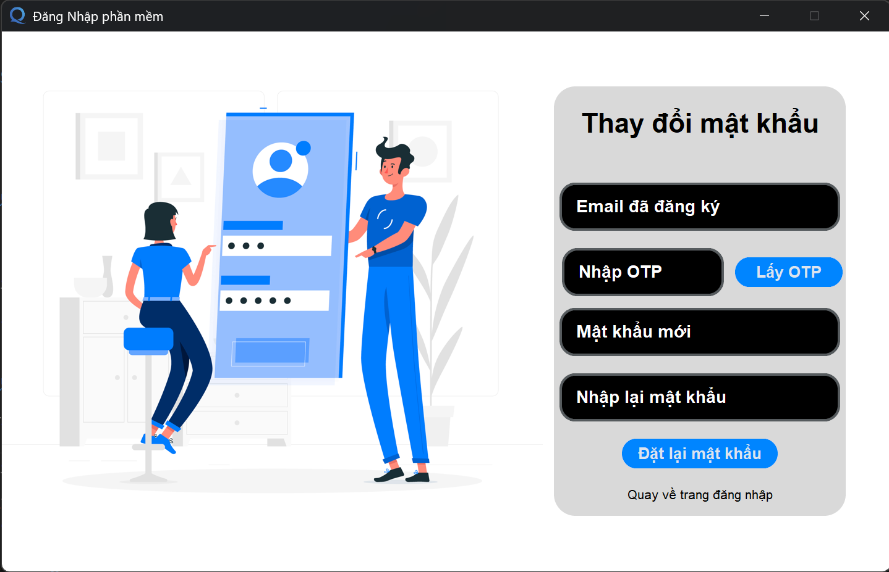
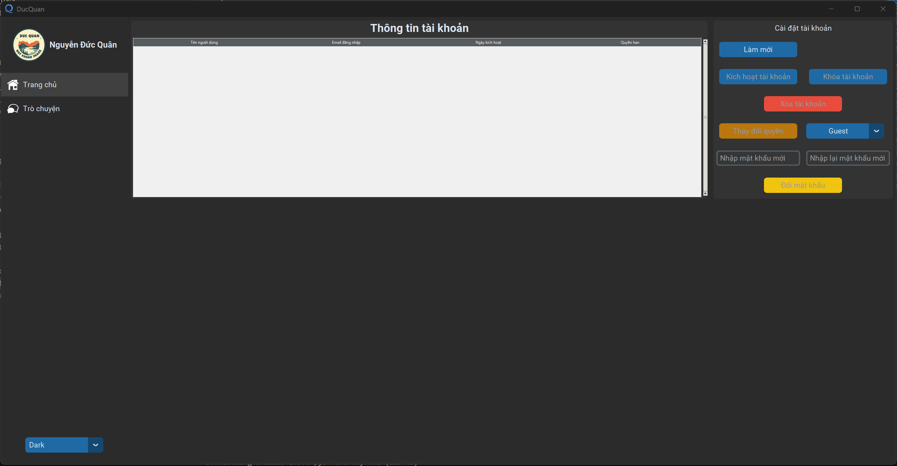
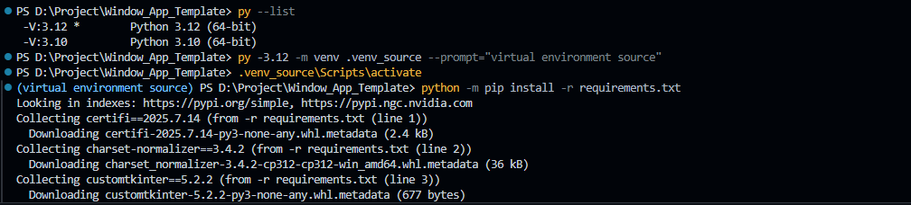
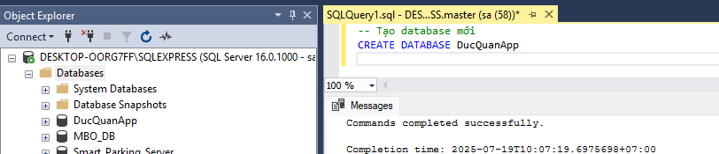
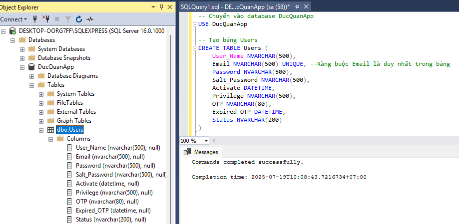
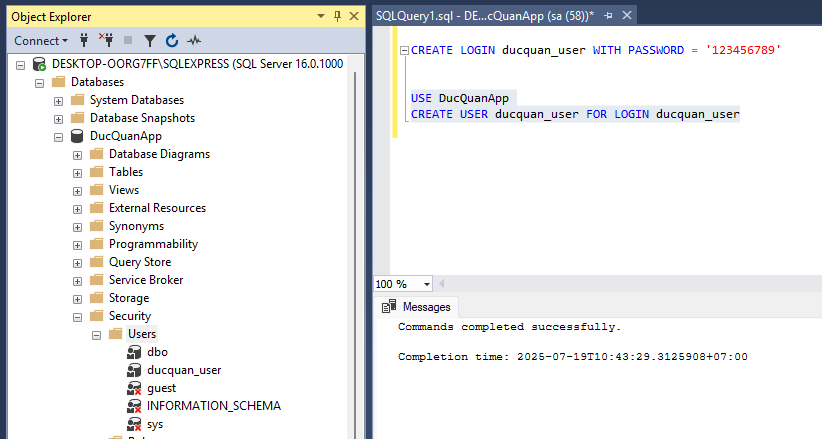
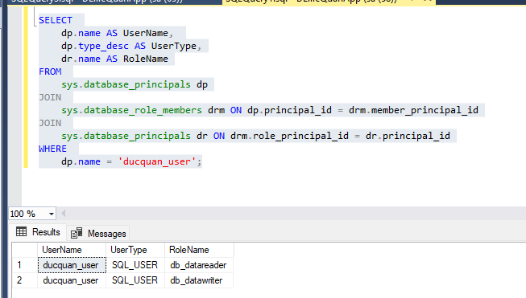

# Chương trình phần mềm trên máy tính windows được xây dựng bằng Python  


> [!NOTE]  
> Tổng quan về phần mềm  

## 1.Phần mềm có chức năng đăng nhập trước khi sử dụng phần mềm  


> [!TIP]
> 💡 Tài khoản đăng nhập mặc định **tên đăng nhập: Test, mật khẩu: Test**  

Phần mềm đươc phân quyền với 3 mức độ: `Admin`, `User`, `Guest`  

- `Admin`: Được truy cập toàn bộ chức năng  
- `User`: Được truy cập toàn bộ chức năng (Ngoại trừ trang chủ)  
- `Guest`: Giới hạn truy cập một số chức năng cụ thể  

## 1.1 Chức năng tạo tài khoản mới

Nếu chưa có tài khoản thì có thể sử dụng chức năng tạo tài khoản mới để đăng nhập.  

  

Sau khi tạo tài khoản xong vẫn `chưa thể đăng nhập` được trừ khi được tài khoản có quyền `admin` kích hoạt tài khoản cho từ tab `Trang chủ`. Xem thêm [tại đây]()  

## 1.2 Chức năng quên mật khẩu  

Khi bạn đã có tài khoản sử dụng nhưng `quên mật khẩu` thì có thể sử dụng chức năng quên mật khẩu từ trang đăng nhập.  



Yêu cầu người dùng nhập email đã đăng ký và ấn nút `Lấy OTP` để nhận 1 mã 6 chữ số thì mới có thể thay đổi mật khẩu. Mã OTP sẽ được gửi tới mail đã đăng ký, thời hạn của mã OTP sẽ là 5 phút.  

## 2. Trang chủ
Sau khi đăng nhập phần mềm thành công sẽ tiến vào trang chủ (nếu tài khoản là admin)  



Tại đây có thể `kích hoạt tài khoản`, `Xóa tài khoản`, `Thay đổi quyền hạn`, ...  


> [!NOTE]  
> Lập trình phần mềm với Python  

> [!IMPORTANT]  
> **Trước khi đi vào lập trình phần mềm cần lưu ý một số điều sau**  
> **Python: từ 3.12 trở lên**  
> **Database: Sử dụng SQL Server**  

# 1. Tạo môi trường ảo

Để đảm bảo an toàn và tránh cài đặt những thứ không cần thiết vào thư mục gốc của máy tính thì ta sử dụng môi trường ảo. Có thể tham khảo về môi trường ảo trong Python tại [github](https://github.com/NguyenDucQuan12/virtual_environment_python) hoặc [youtube](https://youtu.be/FnqKNUp4Htg).  

Chạy lệnh sau để tạo môi trường ảo:  

```python
python -m venv .venv_source --prompt="virtual environment source"
```

Nếu trong máy bạn có nhiều hơn 1 phiên bản Python thì chạy như sau (ví dụ chỉ định cụ thể phiên bản 3.12):  
```python
py -3.12 -m venv .venv_source --prompt="virtual environment source"
```

Kích hoạt môi trường ảo:  
```python
.venv_source\Scripts\activate
```

Cài đặt các thư viện cần thiết:  
```python
python -m pip install -r requirements.txt
```



Liệt kê các thư viện đã sử dụng vào tệp `requirements.txt`:  
```python
python -m pip freeze > requirements.txt
```

# 2. Tạo CSDL

> [!NOTE]  
> ## Cài đặt driver ODBC cho từng thiết bị!  

Để có thể kết nối được `Python` với `SQL Server` ta cần sử dụng `driver ODBC`. Driver được tải trực tiếp từ `Microsoft`.  

Đầu tiên ta cần tạo 1 CSDL trước có tên là `DucQuanApp`:  
```SQL
-- Tạo database mới
CREATE DATABASE DucQuanApp
```


Sau khi tạo xong Database ta cần chuyển đến `DucQuanApp` thì mới có thể thực hiện thao tác đối với CSDL này:  
```SQL
-- Chuyển vào database DucQuanApp
USE DucQuanApp
```
Sau đó ta tiến hành tạo bảng chứa thông tin đăng nhập có tên là `Users` và các trường thông tin cần thiết:  
```SQL
-- Tạo bảng Users
CREATE TABLE Users (
	User_Name NVARCHAR(500),
	Email NVARCHAR(500) UNIQUE, --Ràng buộc Email là duy nhất trong bảng
	Password NVARCHAR(500),
	Salt_Password NVARCHAR(500),
	Activate DATETIME,
	Privilege NVARCHAR(500),
	OTP NVARCHAR(80),
	Expired_OTP DATETIME,
	Status NVARCHAR(200)
)
```


Nếu lúc tạo bảng mà quên thêm ràng buộc cho cột `Email` thì sử dụng lệnh sau:  
```SQL
-- Thêm ràng buộc cho bảng nếu quên lúc tạo
ALTER TABLE Users
ADD CONSTRAINT UQ_Email UNIQUE (Email)
```

Sau khi đã có bảng thì thêm 1 dòng dữ liệu ban đầu để đăng nhập:  
```SQL
-- Thêm dữ liệu mới vào bảng
INSERT INTO Users
(
    User_Name,
    Email,
    Password,
    Salt_Password,
    Activate,
    Privilege,
    OTP,
    Expired_OTP,
    Status
)
VALUES (
    N'Nguyễn Đức Quân',
    'nguyenducquan2001@gmail.com',
    '152a4a4f24e8481810b9b01c1ef148034f38c17fb40175e29201b767906558f455032735d0f144f052bd10bac553191dbd02c8d3d3c594023c8517ea72f47955',
    'ca5e4c62a549cbe349b5cb78822ad671',
    GETDATE(), -- Lấy thời gian hiện tại
    'Admin',
    'hst283r',
    DATEADD(HOUR, 1, GETDATE()), -- Thêm thời gian 1 tiếng cho thời gian hiện tại
    NULL
)
```

> Lưu ý giá trị 2 trường `Password` và `Salt_Password` phải tuân thủ cách mã hóa ở [tệp mã hóa](src/services/hash.py).  
> Ví dụ mật khẩu phía trên là: `123456789`  

Để có thể có quyền truy cập vào CSDL bằng tài khoản thì ta cần tạo tài khoản login, tạo người dùng và cấp quyền trong SQL Server:

Bước 1: Tạo tài khoản login với với tên là `ducquan_user` và mật khẩu là `123456789`:  
```SQL
CREATE LOGIN ducquan_user WITH PASSWORD = '123456789'
```
> [!NOTE]  
> Đây chỉ là tài khoản để đăng nhập vào SQL Server, không thể truy cập Database.  


Bước 2: Tạo người dùng trong CSDL `DucQuanApp` để tài khoản vừa tạo có thể truy cập CSDL `DucQuanApp`:  
```SQL
USE DucQuanApp
CREATE USER ducquan_user FOR LOGIN ducquan_user
```



Bước 3: Cấp quyền truy cập cho người dùng để có thể thao tác với dữ liệu:  
```SQL
ALTER ROLE db_datareader ADD MEMBER ducquan_user  -- Cấp quyền đọc dữ liệu  
ALTER ROLE db_datawriter ADD MEMBER ducquan_user -- cấp quyền ghi dữ liệu

-- Cấp quyền quản trị CSDL (Cấp quyền truy cập đầy đủ)
ALTER ROLE db_owner ADD MEMBER ducquan_user
```
Bước 4: Kiểm tra lại quyền truy cập bằng câu lệnh sau:  

```SQL
SELECT 
    dp.name AS UserName, 
    dp.type_desc AS UserType,
    dr.name AS RoleName
FROM 
    sys.database_principals dp
JOIN 
    sys.database_role_members drm ON dp.principal_id = drm.member_principal_id
JOIN 
    sys.database_principals dr ON drm.role_principal_id = dr.principal_id
WHERE 
    dp.name = 'ducquan_user';
```



Một số lệnh cấp quyền cho người dùng trong SQL Server:  

Các lệnh `DENY`, `GRANT`, `REVOKE`, và `ALTER ROLE` đều được sử dụng để quản lý quyền truy cập của người dùng trong SQL Server, nhưng chúng có chức năng và cách thức hoạt động khác nhau.  

`DENY`, `GRANT`, `REVOKE` chỉ áp dụng cho người dùng hoặc vai trò (role) trên một đối tượng trong cơ sở dữ liệu (ví dụ: bảng, view, thủ tục, v.v.).   

## GRANT - Cấp quyền cho người dùng hoặc nhóm người dùng

- Mục đích: Cấp quyền cho người dùng hoặc vai trò (role) trên một đối tượng trong cơ sở dữ liệu (ví dụ: bảng, view, thủ tục, v.v.).  

- Cách thức hoạt động: Khi sử dụng lệnh `GRANT`, bạn cấp quyền cho người dùng hoặc vai trò với khả năng thực hiện một hành động cụ thể (như `SELECT`, `INSERT`, `UPDATE`, `DELETE`) trên các đối tượng của cơ sở dữ liệu.  

> Cú pháp:  
> GRANT <quyền> ON <đối tượng> TO <người dùng> 

```SQL
GRANT SELECT ON dbo.Users TO ducquan_user;  -- Chỉ cấp quyền SELECT cho người dùng đối với bảng Users trong CSDL  
GRANT SELECT, INSERT, UPDATE ON dbo.Users TO ducquan_user;  -- Cấp quyền SELECT, INSERT và UPDATE, không cấp quyền DELETE
```

## DENY - Từ chối quyền của người dùng cho các thao tác vs DB 

- Mục đích: Từ chối quyền cho người dùng hoặc vai trò đối với một đối tượng trong cơ sở dữ liệu.  

- Cách thức hoạt động: Khi sử dụng lệnh `DENY`, quyền mà bạn đã cấp hoặc chưa cấp sẽ bị từ chối cho người dùng hoặc vai trò đối với một đối tượng. `DENY` có mức độ ưu tiên cao hơn `GRANT`, tức là nếu một người dùng đã có quyền `GRANT` nhưng bạn sử dụng `DENY`, quyền `DENY` sẽ có hiệu lực và người dùng sẽ bị từ chối quyền đó.  

> Cú pháp:  
> DENY <quyền> ON <đối tượng> TO <người dùng> 

```SQL
DENY SELECT ON dbo.Users TO ducquan_user;  -- Từ chối quyền SELECT của người dùng đối với bảng trong DB
```

## REVOKE - Thu hồi quyền của người dùng

- Mục đích: Thu hồi quyền mà bạn đã cấp trước đó. `REVOKE` sẽ loại bỏ quyền truy cập của người dùng hoặc vai trò đối với một đối tượng mà quyền đó đã được cấp.  

- Cách thức hoạt động: Khi sử dụng lệnh `REVOKE`, quyền truy cập của người dùng hoặc vai trò vào một đối tượng bị thu hồi. Tuy nhiên, lệnh này sẽ không thay đổi quyền nếu người dùng có quyền đó thông qua các vai trò khác.  

> Cú pháp:  
> REVOKE <quyền> ON <đối tượng> TO <người dùng> 

```SQL
REVOKE SELECT ON dbo.Users TO ducquan_user; -- Thu hồi quyền SELECT đổi với người dùng
```

## ALTER ROLE

- Mục đích: Thay đổi vai trò của người dùng `trong cơ sở dữ liệu`. Lệnh này cho phép bạn thêm hoặc xóa người dùng từ một vai trò cụ thể `trong cơ sở dữ liệu`.  

- Cách thức hoạt động: Khi sử dụng `ALTER ROLE`, bạn có thể thay đổi các vai trò của người dùng trong cơ sở dữ liệu. Vai trò là một nhóm quyền mà bạn có thể cấp cho người dùng. Bạn có thể thêm người dùng vào các vai trò như `db_datareader`, `db_datawriter`, `db_owner`, v.v.  

> Cú pháp:  
> ALTER ROLE <vai trò> ADD MEMBER <người dùng>;  
> ALTER ROLE <vai trò> DROP MEMBER <người dùng>;  

```SQL
ALTER ROLE db_datareader ADD MEMBER ducquan_user;
```

## Cách truy vấn các quyền đã cấp cho tài khoản người dùng

Kiểm tra các `vai trò` (vai trò được thêm bởi lệnh `ALTER ROLE`) mà người dùng đã tham gia, ví dụ đối với người dùng `ducquan_user`:  
```SQL
SELECT 
    dp.name AS UserName, 
    dp.type_desc AS UserType,
    dr.name AS RoleName
FROM 
    sys.database_principals dp
JOIN 
    sys.database_role_members drm ON dp.principal_id = drm.member_principal_id
JOIN 
    sys.database_principals dr ON drm.role_principal_id = dr.principal_id
WHERE 
    dp.name = 'ducquan_user';

```

Hoặc có thể kiểm tra tất cả `vai trò` trong CSDL:  

```SQL
SELECT 
    dp.name AS UserName, 
    dr.name AS RoleName
FROM 
    sys.database_principals dp
LEFT JOIN 
    sys.database_role_members drm ON dp.principal_id = drm.member_principal_id
LEFT JOIN 
    sys.database_principals dr ON drm.role_principal_id = dr.principal_id
WHERE 
    dp.type IN ('S', 'U')  -- 'S' cho SQL_USER và 'U' cho Windows User
ORDER BY 
    dp.name, dr.name;
```

Kiểm tra `quyền` (quyền được thêm bởi các lệnh `GRANT`, `DENY`, `REVOKE`) mà người dùng đã được cấp đối với các đối tượng cụ thể (ví dụ: bảng, view):  

```SQL
SELECT 
    dp.name AS UserName,
    ob.name AS ObjectName,
    perm.permission_name,
    perm.state_desc AS PermissionState
FROM 
    sys.database_permissions perm
JOIN 
    sys.objects ob ON perm.major_id = ob.object_id
JOIN 
    sys.database_principals dp ON perm.grantee_principal_id = dp.principal_id
WHERE 
    dp.name = 'ducquan_user';
```

Hoặc kiểm tra tất cả các quyền trong 1 dối tượng như bảng `Users`:  
```SQL
SELECT 
    dp.name AS UserName,
    ob.name AS ObjectName,
    perm.permission_name,
    perm.state_desc AS PermissionState
FROM 
    sys.database_permissions perm
JOIN 
    sys.objects ob ON perm.major_id = ob.object_id
JOIN 
    sys.database_principals dp ON perm.grantee_principal_id = dp.principal_id
WHERE 
    ob.name = 'Users';  -- Tên bảng hoặc đối tượng bạn muốn kiểm tra
```


> [!QUESTION]  
> ❓ Các câu hỏi thường gặp  