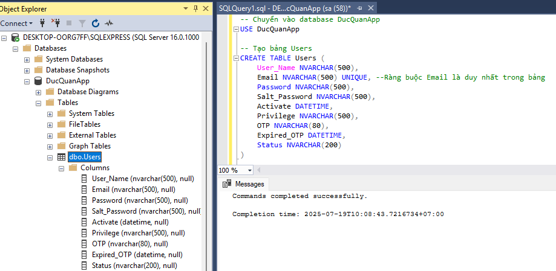

# Chương trình phần mềm trên máy tính windows được xây dựng bằng Python  


> [!NOTE]  
> Tổng quan về phần mềm  

## 1. Phần mềm có chức năng đăng nhập trước khi sử dụng phần mềm  


> [!TIP]
> 💡 Tài khoản đăng nhập mặc định **Test - Test**  
> Các tài khoản khác đăng nhập theo : Email và Password  

Phần mềm được phân quyền với 3 mức độ: `Admin`, `User`, `Guest`  

- `Admin`: Được truy cập toàn bộ chức năng  
- `User`: Được truy cập toàn bộ chức năng (Ngoại trừ trang chủ)  
- `Guest`: Giới hạn truy cập một số chức năng cụ thể  

## 1.1 Chức năng tạo tài khoản mới

Nếu chưa có tài khoản thì có thể sử dụng chức năng tạo tài khoản mới để đăng nhập.  

  

Sau khi tạo tài khoản xong vẫn `chưa thể đăng nhập` được trừ khi được tài khoản có quyền `admin` kích hoạt tài khoản cho từ tab `Trang chủ`. Xem thêm [tại đây]()  

## 1.2 Chức năng quên mật khẩu  

Khi bạn đã có tài khoản sử dụng nhưng `quên mật khẩu` thì có thể sử dụng chức năng quên mật khẩu từ trang đăng nhập.  


Yêu cầu người dùng nhập `email đã đăng ký` và ấn nút `Lấy OTP` để nhận 1 mã `6 chữ số` thì mới có thể thay đổi mật khẩu. Mã OTP sẽ được gửi tới mail đã đăng ký, thời hạn của mã OTP sẽ là `5 phút`.  

## 2. Trang chủ
Sau khi đăng nhập phần mềm thành công sẽ tiến vào trang chủ `(nếu tài khoản là admin)`  


Tại đây có thể `kích hoạt tài khoản`, `Xóa tài khoản`, `Thay đổi quyền hạn`, ...  

# Lập trình phần mềm với Python  

> [!IMPORTANT]  
> **Trước khi đi vào lập trình phần mềm cần lưu ý một số điều sau**  
> **Python**: từ 3.12 trở lên  
> **Database**: SQL Server  
> **Công cụ lập trình**: Visual Studio Code  
> ## Cài đặt driver ODBC cho từng thiết bị sử dụng phần mềm!  

Để chương trình có thể kết nối với `SQL Server` ta cần sử dụng `driver ODBC`. Driver được tải trực tiếp từ `Microsoft`.

Đầu tiên ta cần sao chép dự án này về máy tính, ta có thể download hoặc clone nó về và đặt tên thư mục tương ứng.  
Sau đó mở thư mục này lên và thêm nó vào `workspace` của Visual studio code bằng chức năng `Add Folder To Workspace`. Ta sẽ được như sau:  


Tất cả các thao tác lệnh được thực hiện trên `Terminal` của `Visual studio code`  


# 1. Tạo môi trường ảo

Để đảm bảo an toàn và tránh cài đặt những thứ không cần thiết vào thư mục gốc của máy tính thì ta sử dụng `môi trường ảo`. Có thể tham khảo về môi trường ảo trong Python tại [github](https://github.com/NguyenDucQuan12/virtual_environment_python) hoặc [youtube](https://youtu.be/FnqKNUp4Htg).  

Chạy lệnh sau để tạo môi trường ảo:  

```python
python -m venv .venv_source --prompt="virtual environment source"
```

Nếu trong máy bạn có nhiều hơn 1 phiên bản Python thì chạy như sau (ví dụ chỉ định cụ thể phiên bản 3.12):  
```python
py -3.12 -m venv .venv_source --prompt="virtual environment source"
```

Kích hoạt môi trường ảo:  
```python
.venv_source\Scripts\activate
```

Cài đặt các thư viện cần thiết:  
```python
python -m pip install -r requirements.txt
```


Liệt kê các thư viện đã sử dụng vào tệp `requirements.txt`:  
```python
python -m pip freeze > requirements.txt
```

Khởi động chương trình bằng `Terminal` của `VS code`:  
```python
python src/main.py
```

# 2. Tạo CSDL  

Mở `SQL Server Management Studio (SSMS)` kết nối tới `Database`, rồi chọn `New Query`.  


Tất cả các lệnh đều được thực hiện ở đây. Đầu tiên ta cần tạo 1 CSDL trước có tên là `DucQuanApp`.  
```SQL
-- Tạo database mới
CREATE DATABASE DucQuanApp
```


Sau khi tạo xong Database ta cần chuyển đến `DucQuanApp` thì mới có thể thực hiện thao tác đối với CSDL này:  
```SQL
-- Chuyển vào database DucQuanApp
USE DucQuanApp
```

# 2.1 Tạo bảng UserProfiles

Ta tạo bảng chứa thông tin người dùng  

> Bảng này hiện tại chưa cần dùng  
> Trường UserId tạm thời hãy chuyển từ NOT NULL sang NULL  

```SQL
CREATE TABLE dbo.UserProfiles
(
    UserId VARCHAR(16) NOT NULL,
    FullName NVARCHAR(200) NULL,
    PhoneNumber NVARCHAR(30) NULL,
    DateOfBirth DATE NULL,
    Address NVARCHAR(500) NULL,
    AvatarUrl NVARCHAR(2048) NULL,
    CreatedAt DATETIME2(7) NOT NULL
        CONSTRAINT DF_UserProfiles_CreatedAt DEFAULT SYSUTCDATETIME(),
    UpdatedAt DATETIME2(7) NOT NULL
        CONSTRAINT DF_UserProfiles_UpdatedAt DEFAULT SYSUTCDATETIME()
);
```

## 2.2 Tạo bảng Users

Sau đó ta tiến hành tạo bảng chứa thông tin đăng nhập của người dùng có tên là `Users` và các trường thông tin cần thiết:  
```SQL
-- Tạo bảng Users
CREATE TABLE Users (
    UserId VARCHAR(16) NOT NULL,
	UserName NVARCHAR(200) NOT NULL,
	Email NVARCHAR(320) NOT NULL UNIQUE, --Ràng buộc Email là duy nhất trong bảng
	PasswordHash NVARCHAR(500) NULL,
	PasswordSalt NVARCHAR(500) NULL,
	IsActivate BIT NOT NULL
        CONSTRAINT DF_Users_IsActive DEFAULT (0),
	ActivatedAt DATETIME2(7) NULL,
	Privilege NVARCHAR(50) NOT NULL
        CONSTRAINT DF_Users_Privilege DEFAULT (N'User'),
	Status NVARCHAR(50) NULL,
	CreatedAt DATETIME2(7) NOT NULL
        CONSTRAINT DF_Users_CreatedAt DEFAULT SYSUTCDATETIME(),
	UpdatedAt DATETIME2(7) NOT NULL
        CONSTRAINT DF_Users_UpdatedAt DEFAULT SYSUTCDATETIME(),
	LastLoginAt DATETIME2(7) NULL
)
```


Nếu lúc tạo bảng mà quên thêm ràng buộc cho cột `Email` thì sử dụng lệnh sau:  
```SQL
-- Thêm ràng buộc cho bảng nếu quên lúc tạo
ALTER TABLE Users
ADD CONSTRAINT UQ_Email UNIQUE (Email)
```

Tạo index để tăng tốc độ tìm kiếm dựa trên email người dùng  
```SQL
CREATE UNIQUE INDEX UX_Users_Email
ON dbo.Users(Email);
```

Sau khi đã có bảng thì thêm 1 dòng dữ liệu ban đầu để đăng nhập:  
```SQL
-- Thêm dữ liệu mới vào bảng
INSERT INTO Users
(
    UserId,
    UserName,
    Email,
    PasswordHash,
    PasswordSalt,
    IsActivate,
    ActivateAt,
    Privilege,
    Status
)
VALUES (
    '3ksb6oagp405habu',
    N'Nguyễn Đức Quân',
    'nguyenducquan2001@gmail.com',
    '152a4a4f24e8481810b9b01c1ef148034f38c17fb40175e29201b767906558f455032735d0f144f052bd10bac553191dbd02c8d3d3c594023c8517ea72f47955',
    'ca5e4c62a549cbe349b5cb78822ad671',
    1,
    GETDATE(), -- Lấy thời gian hiện tại
    'Admin',
    'Active',
)
```

> Lưu ý giá trị 2 trường `Password` và `Salt_Password` phải tuân thủ cách mã hóa ở [tệp mã hóa](src/services/hash.py).  
> Ví dụ mật khẩu phía trên là: `123456789`  

## 2.3 Tạo bảng AuthSession

Tiếp theo tạo bảng `AuthSession` để lưu trữ các phiên đăng nhập  
```SQL
-- 1. Tạo bảng cấu trúc chuẩn hóa cho phiên đăng nhập
CREATE TABLE dbo.AuthSession (
    UserId VARCHAR(16) NOT NULL,
    SessionId bigint IDENTITY(1,1) NOT NULL,
    UserEmail nvarchar(256) NOT NULL,
    TokenHash binary(32) NOT NULL,
    CreatedAt datetime2(7) NOT NULL,
    ExpiresAt datetime2(7) NOT NULL,
    RevokedAt datetime2(7) NULL,
    DeviceInfo nvarchar(256) NULL,

    -- Định nghĩa các Ràng buộc (Constraints)
    CONSTRAINT PK_AuthSession PRIMARY KEY CLUSTERED (SessionId),
    CONSTRAINT FK_AuthSession_User FOREIGN KEY (UserEmail) REFERENCES dbo.Users(Email),
    CONSTRAINT CK_AuthSession_Expiry CHECK (ExpiresAt > CreatedAt),
    CONSTRAINT UQ_AuthSession_TokenHash UNIQUE (TokenHash),
    CONSTRAINT DF_AuthSession_Created DEFAULT SYSUTCDATETIME() FOR CreatedAt
);

-- 2. Tạo các chỉ mục (Indexes) tối ưu hiệu năng
-- Index tìm kiếm phiên hoạt động theo User và sắp xếp theo Session mới nhất
CREATE INDEX IX_AuthSession_UserActive 
    ON dbo.AuthSession (UserEmail, SessionId DESC)
    INCLUDE (ExpiresAt, CreatedAt, DeviceInfo) 
    WHERE RevokedAt IS NULL;

-- Index phục vụ cho việc dọn dẹp các token đã hết hạn (Cron job/Clean up)
CREATE INDEX IX_AuthSession_Expiry 
    ON dbo.AuthSession (ExpiresAt);

-- Index phục vụ tìm kiếm các phiên đã bị hủy (Filtered Index)
CREATE INDEX IX_AuthSession_Revoked 
    ON dbo.AuthSession (RevokedAt) 
    WHERE RevokedAt IS NOT NULL;
```

## 2.4 Tạo bảng UserOTP
Tạo bảng này chứa thông tin mã OTP  
```SQL
CREATE TABLE dbo.UserOTP (
    UserId int NOT NULL,
    Email nvarchar(200) NOT NULL,
    OTP nvarchar(80) NOT NULL,
    Expired_OTP datetime2(7) NOT NULL,
    Purpose nvarchar(50) NOT NULL,
    CreatedAt datetime2(7) NOT NULL CONSTRAINT DF_UserOTP_CreatedAt DEFAULT SYSUTCDATETIME(),
);
```
## 2.5 Tạo bảng UserExternalLogin
Tạo bảng này lưu trữ thông tin người dùng đăng nhập bằng nhà cung cấp thứ ba như `Google` hoặc `Facebook`  
```SQL
CREATE TABLE dbo.UserExternalLogin (
    UserId VARCHAR(16) NOT NULL,
    UserEmail nvarchar(32) NOT NULL,
    Provider nvarchar(50) NOT NULL,
    ProviderUserId nvarchar(255) NOT NULL,
    ProviderEmail nvarchar(320) NULL,
    CreatedAt datetime2(7) NOT NULL,
    UpdatedAt datetime2(7) NOT NULL
);
```
Tạo index  
```SQL
CREATE UNIQUE INDEX UX_ExternalLogin_Provider_ProviderUserId
ON dbo.UserExternalLogin(Provider, ProviderUserId);
```
## 2.6 Tạo các procedure

### 1. Procedure tạo tài khoản mới khi đăng nhập bằng Google hoặc Facebook

Khi người dùng sử dụng chức năng đăng nhập bằng mạng xã hội như `Facebook` hoặc `Google` sẽ có các trường hợp sau:  
Ví dụ với `google`  

1. Người dùng đã có tài khoản nhưng chưa liên kết với google
Ban đầu người dùng tạo tài khoản trên phần mềm, họ đã có `tài khoản nội bộ` dùng để đăng nhập. Lần sau họ đăng nhập thì họ sử dụng tài khoản google thì ta cần thông báo cho họ đăng nhập bằng tài khoản nội bộ và tiến hành liên kết tài khoản google với tài khoản này, không tự động liên kết mail này với tài khoản nội bộ.  

2. Người dùng đã có tài khoản và đã liên kết với tài khoản google
Với người dùng đã có tài khoản nội bộ và đã liên kết với tài khoản google thì khi họ sử dụng bất kỳ cách đăng nhập nào thì cũng tiến hành đăng nhập cho họ.  

3. Người dùng hoàn toàn mới  
Đây là lần đầu họ đăng nhập phần mềm, vì vậy khi họ đăng nhập bằng tài khoản Google thì ta cần tạo cho họ một tài khoản nội bộ dùng để đăng nhập bình thường, nhưng mật khẩu để `NULL`, và liên kết tài khoản nội bộ đó với tài khoản google này. Sau đó thông báo người dùng cần đợi Admin kích hoạt tài khoản này để sử dụng.  

SQL dưới đây giải quyết các vấn đề trên.  
```SQL
USE [DucQuanApp];
GO

CREATE OR ALTER PROCEDURE dbo.usp_ResolveOrRegisterExternalUser
    @Provider       NVARCHAR(50),
    @ProviderUserId NVARCHAR(255),
    @ProviderEmail  NVARCHAR(320),
    @DisplayName    NVARCHAR(200)
AS
BEGIN
    SET NOCOUNT ON;
    SET XACT_ABORT ON;

    IF @@TRANCOUNT = 0
        THROW 51001, N'Procedure requires an active transaction.', 1;

    -- Chuẩn hóa tên provider; không đổi ProviderUserId.
    SET @Provider = LOWER(LTRIM(RTRIM(@Provider)));
    SET @ProviderEmail = LTRIM(RTRIM(@ProviderEmail));
    SET @DisplayName = LTRIM(RTRIM(@DisplayName));

    IF @Provider IS NULL
       OR @Provider NOT IN (N'google', N'facebook')
        THROW 51002, N'Nhà cung cấp không được hỗ trợ.', 1;

    IF @ProviderUserId IS NULL
       OR LEN(LTRIM(RTRIM(@ProviderUserId))) = 0
        THROW 51003, N'Không xác định được định danh từ nhà cung cấp.', 1;

    IF @ProviderEmail IS NULL
       OR LEN(@ProviderEmail) = 0
        THROW 51004, N'Nhà cung cấp không trả về email', 1;

    IF @DisplayName IS NULL OR LEN(@DisplayName) = 0
        SET @DisplayName = N'Người dùng mới';

    /*
        Hai người hoặc hai cửa sổ có thể gửi cùng một yêu cầu gần như đồng thời. Khóa này giúp các lần gọi procedure trên xử lý tuần tự trong phạm vi database.
    */
    DECLARE @LockResult INT;

    EXEC @LockResult = sys.sp_getapplock
        @Resource = N'Quan.ExternalIdentity.ResolveOrRegister.v1',
        @LockMode = N'Exclusive',
        @LockOwner = N'Transaction',
        @LockTimeout = 5000;

    IF @LockResult < 0
        THROW 51005, N'Hệ thống đang xử lý xác thực đăng nhập phiên trước đó chưa hoàn thành.', 1;

    DECLARE
        @ResultCode      NVARCHAR(40),
        @InternalEmail   NVARCHAR(320),
        @InternalName    NVARCHAR(200),
        @Privilege       NVARCHAR(100),
        @IsActive        BIT,
        @StoredId        NVARCHAR(255),
        @MappingCount    BIGINT,
        @UserCount       BIGINT;

    /*
        BƯỚC 1: tìm bằng Provider + ProviderUserId.
        Không dùng email provider để thay thế mapping.
    */
    SELECT @MappingCount = COUNT_BIG(*)
    FROM dbo.UserExternalLogin WITH (UPDLOCK, HOLDLOCK)
    WHERE Provider = @Provider
      AND ProviderUserId = @ProviderUserId;

    IF @MappingCount > 1
        THROW 51006, N'ID này được liên kết nhiều hơn một tài khoản, không hợp lệ', 1;

    IF @MappingCount = 1
    BEGIN
        SELECT
            @InternalEmail = UserEmail,
            @StoredId = ProviderUserId
        FROM dbo.UserExternalLogin
        WHERE Provider = @Provider
          AND ProviderUserId = @ProviderUserId;

        /*
            Provider ID phải khớp chính xác. Không coi hai ID khác hoa/thường là cùng danh tính.
        */
        IF @StoredId IS NULL
           OR @StoredId COLLATE Latin1_General_100_BIN2
              <> @ProviderUserId COLLATE Latin1_General_100_BIN2
           OR DATALENGTH(@StoredId) <> DATALENGTH(@ProviderUserId)
            THROW 51007, N'Không tìm thấy ID hợp lệ cho người dùng này', 1;

        SELECT @UserCount = COUNT_BIG(*)
        FROM dbo.Users WITH (UPDLOCK, HOLDLOCK)
        WHERE Email = @InternalEmail;

        IF @UserCount <> 1
            THROW 51008, N'Tài khoản này được liên kết bất thường với tài khoản nội bộ. Không thể đăng nhập', 1;

        SELECT
            @InternalName = UserName,
            @Privilege = Privilege,
            @IsActive = IsActive
        FROM dbo.Users
        WHERE Email = @InternalEmail;

        SET @ResultCode =
            CASE
                WHEN @IsActive = 1 THEN N'LOGIN_ALLOWED'
                ELSE N'ACCOUNT_INACTIVE'
            END;
    END
    ELSE
    BEGIN
        /*
            BƯỚC 2: chưa có mapping -> kiểm tra email nội bộ.

            Chỉ kiểm tra để quyết định LINK_REQUIRED hay tạo mới.
            Email trùng không đủ điều kiện đăng nhập.
        */
        SELECT @UserCount = COUNT_BIG(*)
        FROM dbo.Users WITH (UPDLOCK, HOLDLOCK)
        WHERE Email = @ProviderEmail;

        IF @UserCount > 1
            THROW 51009, N'Email này trùng với email đã có trong tài khoản nội bộ', 1;

        IF @UserCount = 1
        BEGIN
            SET @ResultCode = N'LINK_REQUIRED';
        END
        ELSE
        BEGIN
            /*
                BƯỚC 3: tài khoản mới hoàn toàn.
                Mặc định quyền hạn là User và tình trạng kích hoạt là 0
            */
            INSERT INTO dbo.Users
            (
                UserName,
                Email,
                PasswordHash,
                PasswordSalt,
                IsActive,
                Privilege
            )
            VALUES
            (
                @DisplayName,
                @ProviderEmail,
                NULL,
                NULL,
                0,
                N'User'
            );

            DECLARE @Now DATETIME2(7) = SYSUTCDATETIME();

            INSERT INTO dbo.UserExternalLogin
            (
                UserEmail,
                Provider,
                ProviderUserId,
                ProviderEmail,
                CreatedAt,
                UpdatedAt
            )
            VALUES
            (
                @ProviderEmail,
                @Provider,
                @ProviderUserId,
                @ProviderEmail,
                @Now,
                @Now
            );

            SET @InternalEmail = @ProviderEmail;
            SET @InternalName = @DisplayName;
            SET @Privilege = N'User';
            SET @IsActive = 0;
            SET @StoredId = @ProviderUserId;
            SET @ResultCode = N'CREATED_PENDING';
        END;
    END;

    SELECT
        @ResultCode AS ResultCode,
        @InternalEmail AS UserEmail,
        @InternalName AS UserName,
        @Privilege AS Privilege,
        @IsActive AS IsActive,
        @Provider AS Provider,
        @StoredId AS ProviderUserId;
END;
GO
```

### 2. Procedure cập nhật thời gian đăng nhập
Procedure này sẽ được chạy mỗi khi người dùng đăng nhập thành công, để cập nhật dữ liệu thời gian đăng nhập  
```SQL
USE [DucQuanApp]
GO

CREATE OR ALTER PROCEDURE [dbo].[usp_UpdateLastLoginAt]
    @Email NVARCHAR(320)
AS
BEGIN
    SET NOCOUNT ON;

    UPDATE Users
    SET LastLoginAt = SYSUTCDATETIME(),
        UpdatedAt   = SYSUTCDATETIME()
    WHERE Email = @Email;
END;

```

### 3. Procedure liên kết tài khoản nội bộ với google/facebook
Khi người dùng đăng nhập tài khoản nội bộ, họ muốn liên kết tài khoản này với tài khoản google/facebook thì sử dụng procedure này  
Procedure này trả về `Resultcode` như sau:  
| ResultCode              | Ý nghĩa                                      |
| ----------------------- | -------------------------------------------- |
| LINKED                  | Vừa liên kết thành công                      | 
| ALREADY_LINKED          | Đã liên kết đúng tài khoản này               |
| EXTERNAL_ACCOUNT_IN_USE | Google này thuộc tài khoản nội bộ khác       |
| PROVIDER_ALREADY_LINKED | Tài khoản nội bộ đã liên kết Google khác     |
| USER_NOT_FOUND          | Không tìm thấy tài khoản nội bộ              |
| USER_INACTIVE           | Tài khoản nội bộ chưa kích hoạt hoặc bị khóa |
```SQL
USE [DucQuanApp];
GO

CREATE OR ALTER PROCEDURE dbo.usp_LinkExternalLoginIfNotExists
    @UserEmail      NVARCHAR(320),
    @Provider       NVARCHAR(50),
    @ProviderUserId NVARCHAR(255),
    @ProviderEmail  NVARCHAR(320) = NULL
AS
BEGIN
    SET NOCOUNT ON;
    SET XACT_ABORT ON;

    /*
        Chỉ gọi từ backend tin cậy:
        - @UserEmail lấy từ danh tính nội bộ đã xác thực.
        - @ProviderUserId lấy từ kết quả provider đã xác minh.

        Procedure không tự xác minh token Google/Facebook.
    */
    IF @@TRANCOUNT = 0
        THROW 51100, N'An active transaction is required.', 1;

    SET @UserEmail = LTRIM(RTRIM(@UserEmail));
    SET @Provider = LOWER(LTRIM(RTRIM(@Provider)));
    SET @ProviderEmail = NULLIF(LTRIM(RTRIM(@ProviderEmail)), N'');

    IF @UserEmail IS NULL OR LEN(@UserEmail) = 0
        THROW 51101, N'Địa chỉ email không hợp lệ', 1;

    IF @Provider IS NULL
       OR @Provider NOT IN (N'google', N'facebook')
        THROW 51102, N'Chỉ hỗ trợ liên kết với Google/Facebook', 1;

    IF @ProviderUserId IS NULL
       OR LEN(LTRIM(RTRIM(@ProviderUserId))) = 0
        THROW 51103, N'Không thể xác định mã định danh từ nhà cung cấp.', 1;

    /*
        Dùng CÙNG tên lock với procedure resolve/register số 1.
        Các luồng cùng tuân thủ lock này sẽ không đồng thời tạo hoặc liên kết cùng danh tính.
    */
    DECLARE @LockResult INT;

    EXEC @LockResult = sys.sp_getapplock
        @Resource = N'Quan.ExternalIdentity.ResolveOrRegister.v1',
        @LockMode = N'Exclusive',
        @LockOwner = N'Transaction',
        @LockTimeout = 5000;

    IF @LockResult < 0
        THROW 51104, N'Luồng đang bận xử lý thao tác khác', 1;

    DECLARE
        @ResultCode     NVARCHAR(40),
        @UserCount      BIGINT,
        @MappingCount   BIGINT,
        @ProviderCount  BIGINT,
        @CanonicalEmail NVARCHAR(320),
        @IsActive      BIT,
        @OwnerEmail    NVARCHAR(320),
        @StoredId      NVARCHAR(255);

    -- 1. Kiểm tra tài khoản nội bộ.
    SELECT @UserCount = COUNT_BIG(*)
    FROM dbo.Users WITH (UPDLOCK, HOLDLOCK)
    WHERE Email = @UserEmail;

    IF @UserCount > 1
        THROW 51105, N'Tài khoản nội bộ trùng lặp, không tiến hành liên kết.', 1;

    IF @UserCount = 0
    BEGIN
        SET @ResultCode = N'USER_NOT_FOUND';
    END
    ELSE
    BEGIN
        SELECT
            @CanonicalEmail = Email,
            @IsActive = IsActive
        FROM dbo.Users
        WHERE Email = @UserEmail;

        IF ISNULL(@IsActive, 0) <> 1
        BEGIN
            SET @ResultCode = N'USER_INACTIVE';
        END
        ELSE
        BEGIN
            -- 2. Kiểm tra danh tính Google/Facebook này đã thuộc ai chưa?
            SELECT @MappingCount = COUNT_BIG(*)
            FROM dbo.UserExternalLogin WITH (UPDLOCK, HOLDLOCK)
            WHERE Provider = @Provider
              AND ProviderUserId = @ProviderUserId;

            IF @MappingCount > 1
                THROW 51106, N'Có 2 tài khoản cùng sử dụng danh tính này. Không thể liên kết.', 1;

            -- 3. User này đã liên kết provider đó chưa?
            SELECT @ProviderCount = COUNT_BIG(*)
            FROM dbo.UserExternalLogin WITH (UPDLOCK, HOLDLOCK)
            WHERE UserEmail = @CanonicalEmail
              AND Provider = @Provider;

            IF @ProviderCount > 1
                THROW 51107, N'Tài khoản này đã được liên kết với tài khoản nội bộ khác.', 1;

            IF @MappingCount = 1
            BEGIN
                SELECT
                    @OwnerEmail = UserEmail,
                    @StoredId = ProviderUserId
                FROM dbo.UserExternalLogin
                WHERE Provider = @Provider
                  AND ProviderUserId = @ProviderUserId;

                /*
                    Không để collation không phân biệt hoa/thường
                    biến hai ID khác nhau thành cùng danh tính.
                */
                IF @StoredId IS NULL
                   OR @StoredId COLLATE Latin1_General_100_BIN2
                      <> @ProviderUserId COLLATE Latin1_General_100_BIN2
                   OR DATALENGTH(@StoredId) <> DATALENGTH(@ProviderUserId)
                    THROW 51108, N'Không tìm thấy tài khoản có định danh được cung cấp từ Google/Facebook', 1;

                IF @OwnerEmail = @CanonicalEmail
                    SET @ResultCode = N'ALREADY_LINKED';
                ELSE
                    SET @ResultCode = N'EXTERNAL_ACCOUNT_IN_USE';
            END
            ELSE IF @ProviderCount > 0
            BEGIN
                /*
                    User đã có Google G1 nhưng đang muốn thêm Google G2.
                    Không tự thay thế G1.
                */
                SET @ResultCode = N'PROVIDER_ALREADY_LINKED';
            END
            ELSE
            BEGIN
                -- 4. Tạo liên kết mới.
                DECLARE @Now DATETIME2(7) = SYSUTCDATETIME();

                INSERT INTO dbo.UserExternalLogin
                (
                    UserEmail,
                    Provider,
                    ProviderUserId,
                    ProviderEmail,
                    CreatedAt,
                    UpdatedAt
                )
                VALUES
                (
                    @CanonicalEmail,
                    @Provider,
                    @ProviderUserId,
                    @ProviderEmail,
                    @Now,
                    @Now
                );

                SET @ResultCode = N'LINKED';
            END;
        END;
    END;

    /*
        Không trả email chủ sở hữu tài khoản khác khi xung đột.
        Không dùng SELECT *.
    */
    SELECT
        @ResultCode AS ResultCode,
        @Provider AS Provider;
END;
GO
```

## 2.6 Tạo tài khoản đăng nhập vào CSDL

Để có thể có quyền truy cập vào CSDL bằng tài khoản thì ta cần tạo tài khoản login, tạo người dùng và cấp quyền trong SQL Server:

Bước 1: Tạo tài khoản login với với tên là `ducquan_user` và mật khẩu là `123456789`:  
```SQL
CREATE LOGIN ducquan_user WITH PASSWORD = '123456789'
```
> [!NOTE]  
> Đây chỉ là tài khoản để đăng nhập vào SQL Server, không thể truy cập Database.  


Bước 2: Tạo người dùng trong CSDL `DucQuanApp` để tài khoản vừa tạo có thể truy cập CSDL `DucQuanApp`:  
```SQL
USE DucQuanApp
CREATE USER ducquan_user FOR LOGIN ducquan_user
```


Bước 3: Cấp quyền truy cập cho người dùng để có thể thao tác với dữ liệu:  
```SQL
ALTER ROLE db_datareader ADD MEMBER ducquan_user  -- Cấp quyền đọc dữ liệu  
ALTER ROLE db_datawriter ADD MEMBER ducquan_user -- cấp quyền ghi dữ liệu

-- Cấp quyền quản trị CSDL (Cấp quyền truy cập đầy đủ)
ALTER ROLE db_owner ADD MEMBER ducquan_user
```

Bước 4: Kiểm tra lại quyền truy cập bằng câu lệnh sau:  
```SQL
SELECT 
    dp.name AS UserName, 
    dp.type_desc AS UserType,
    dr.name AS RoleName
FROM 
    sys.database_principals dp
JOIN 
    sys.database_role_members drm ON dp.principal_id = drm.member_principal_id
JOIN 
    sys.database_principals dr ON drm.role_principal_id = dr.principal_id
WHERE 
    dp.name = 'ducquan_user';
```


Vậy là đã hoàn thành cấp quyền truy cập CSDL để thao tác với phần mềm.  
Một số lệnh cấp quyền cho người dùng trong SQL Server (Dùng tham khảo cho các trường hợp phân quyền rõ ràng, giới hạn chức năng cho 1 số người):  

Các lệnh `DENY`, `GRANT`, `REVOKE`, và `ALTER ROLE` đều được sử dụng để quản lý quyền truy cập của người dùng trong SQL Server, nhưng chúng có chức năng và cách thức hoạt động khác nhau.  

`DENY`, `GRANT`, `REVOKE` chỉ áp dụng cho người dùng hoặc vai trò (role) trên một đối tượng trong cơ sở dữ liệu (ví dụ: bảng, view, thủ tục, v.v.).   

### 2.6.1 GRANT - Cấp quyền cho người dùng hoặc nhóm người dùng

- Mục đích: Cấp quyền cho người dùng hoặc vai trò (role) trên một đối tượng trong cơ sở dữ liệu (ví dụ: bảng, view, thủ tục, v.v.).  

- Cách thức hoạt động: Khi sử dụng lệnh `GRANT`, bạn cấp quyền cho người dùng hoặc vai trò với khả năng thực hiện một hành động cụ thể (như `SELECT`, `INSERT`, `UPDATE`, `DELETE`) trên các đối tượng của cơ sở dữ liệu.  

> Cú pháp:  
> GRANT <quyền> ON <đối tượng> TO <người dùng> 

```SQL
GRANT SELECT ON dbo.Users TO ducquan_user;  -- Chỉ cấp quyền SELECT cho người dùng đối với bảng Users trong CSDL  
GRANT SELECT, INSERT, UPDATE ON dbo.Users TO ducquan_user;  -- Cấp quyền SELECT, INSERT và UPDATE, không cấp quyền DELETE
```

### 2.6.2 DENY - Từ chối quyền của người dùng cho các thao tác vs DB 

- Mục đích: Từ chối quyền cho người dùng hoặc vai trò đối với một đối tượng trong cơ sở dữ liệu.  

- Cách thức hoạt động: Khi sử dụng lệnh `DENY`, quyền mà bạn đã cấp hoặc chưa cấp sẽ bị từ chối cho người dùng hoặc vai trò đối với một đối tượng. `DENY` có mức độ ưu tiên cao hơn `GRANT`, tức là nếu một người dùng đã có quyền `GRANT` nhưng bạn sử dụng `DENY`, quyền `DENY` sẽ có hiệu lực và người dùng sẽ bị từ chối quyền đó.  

> Cú pháp:  
> DENY <quyền> ON <đối tượng> TO <người dùng> 

```SQL
DENY SELECT ON dbo.Users TO ducquan_user;  -- Từ chối quyền SELECT của người dùng đối với bảng trong DB
```

### 2.6.3 REVOKE - Thu hồi quyền của người dùng

- Mục đích: Thu hồi quyền mà bạn đã cấp trước đó. `REVOKE` sẽ loại bỏ quyền truy cập của người dùng hoặc vai trò đối với một đối tượng mà quyền đó đã được cấp.  

- Cách thức hoạt động: Khi sử dụng lệnh `REVOKE`, quyền truy cập của người dùng hoặc vai trò vào một đối tượng bị thu hồi. Tuy nhiên, lệnh này sẽ không thay đổi quyền nếu người dùng có quyền đó thông qua các vai trò khác.  

> Cú pháp:  
> REVOKE <quyền> ON <đối tượng> TO <người dùng> 

```SQL
REVOKE SELECT ON dbo.Users TO ducquan_user; -- Thu hồi quyền SELECT đổi với người dùng
```

### 2.6.4 ALTER ROLE

- Mục đích: Thay đổi vai trò của người dùng `trong cơ sở dữ liệu`. Lệnh này cho phép bạn thêm hoặc xóa người dùng từ một vai trò cụ thể `trong cơ sở dữ liệu`.  

- Cách thức hoạt động: Khi sử dụng `ALTER ROLE`, bạn có thể thay đổi các vai trò của người dùng trong cơ sở dữ liệu. Vai trò là một nhóm quyền mà bạn có thể cấp cho người dùng. Bạn có thể thêm người dùng vào các vai trò như `db_datareader`, `db_datawriter`, `db_owner`, v.v.  

> Cú pháp:  
> ALTER ROLE <vai trò> ADD MEMBER <người dùng>;  
> ALTER ROLE <vai trò> DROP MEMBER <người dùng>;  

```SQL
ALTER ROLE db_datareader ADD MEMBER ducquan_user;
```

### 2.6.5 Cách truy vấn các quyền đã cấp cho tài khoản người dùng

Kiểm tra các `vai trò` (vai trò được thêm bởi lệnh `ALTER ROLE`) mà người dùng đã tham gia, ví dụ đối với người dùng `ducquan_user`:  
```SQL
SELECT 
    dp.name AS UserName, 
    dp.type_desc AS UserType,
    dr.name AS RoleName
FROM 
    sys.database_principals dp
JOIN 
    sys.database_role_members drm ON dp.principal_id = drm.member_principal_id
JOIN 
    sys.database_principals dr ON drm.role_principal_id = dr.principal_id
WHERE 
    dp.name = 'ducquan_user';

```

Hoặc có thể kiểm tra tất cả `vai trò` trong CSDL:  

```SQL
SELECT 
    dp.name AS UserName, 
    dr.name AS RoleName
FROM 
    sys.database_principals dp
LEFT JOIN 
    sys.database_role_members drm ON dp.principal_id = drm.member_principal_id
LEFT JOIN 
    sys.database_principals dr ON drm.role_principal_id = dr.principal_id
WHERE 
    dp.type IN ('S', 'U')  -- 'S' cho SQL_USER và 'U' cho Windows User
ORDER BY 
    dp.name, dr.name;
```

Kiểm tra `quyền` (quyền được thêm bởi các lệnh `GRANT`, `DENY`, `REVOKE`) mà người dùng đã được cấp đối với các đối tượng cụ thể (ví dụ: bảng, view):  

```SQL
SELECT 
    dp.name AS UserName,
    ob.name AS ObjectName,
    perm.permission_name,
    perm.state_desc AS PermissionState
FROM 
    sys.database_permissions perm
JOIN 
    sys.objects ob ON perm.major_id = ob.object_id
JOIN 
    sys.database_principals dp ON perm.grantee_principal_id = dp.principal_id
WHERE 
    dp.name = 'ducquan_user';
```

Hoặc kiểm tra tất cả các quyền trong 1 dối tượng như bảng `Users`:  
```SQL
SELECT 
    dp.name AS UserName,
    ob.name AS ObjectName,
    perm.permission_name,
    perm.state_desc AS PermissionState
FROM 
    sys.database_permissions perm
JOIN 
    sys.objects ob ON perm.major_id = ob.object_id
JOIN 
    sys.database_principals dp ON perm.grantee_principal_id = dp.principal_id
WHERE 
    ob.name = 'Users';  -- Tên bảng hoặc đối tượng bạn muốn kiểm tra
```

# 3. Tạo 1 navigation mới

Ví dụ thêm 1 navigation có tên là `Cơ sở dữ liệu`, ta sẽ chỉnh sửa như sau.  

## 3.1 Đặt tên và hình ảnh icon của navigation mới

Ta tạo 1 tên mới cho navigation và các icon tương ứng với nó trong tệp [constants](src/utils/constants.py). Tương ứng ở vị trí tên và image như hình ảnh dưới.  


## 3.2 Thêm nút bấm vào navigation

Sau khi đặt tên và có hình ảnh tương ứng, ta thêm dữ liệu vào biến `self.nav_items` trong hàm `__init__` của `App` [tại đây](src/main.py).  

  

Với cấu trúc cho mỗi navigation như sau:  
```python
DATABASE_NAV: NavItem(
    name=DATABASE_NAV,
    icon_light="DATABASE_NAVIGATION_LIGHT_IMG",
    icon_dark ="DATABASE_NAVIGATION_DARK_IMG",
    required_permissions=(PERMISSION["ADMIN"], PERMISSION["USER"]),
    frame_class=DatabasePage
)
```

Trong đó:  

- `DATABASE_NAV`: Là tên mà ta đã khai báo trong tệp `contanst.py`  
- `icon_light - icon_dark`: Là 2 hình ảnh nút bấm cho navigation này tương ứng với chế độ sáng và tối  
- `required_permissions`: Là 1 danh sách các quyền hạn có thể được truy cập vào navigation này, những người có quyền hạn ko nằm ở đây sẽ ko thể truy cập  
- `frame_class`: Là 1 class chứa toàn bộ nội dung của navigation này, khi người dùng click vào thì nó sẽ hiển thị  

## 3.3 Tạo class hiển thị giao diện  

Để tạo giao diện cho navigation, khi người dùng nhấn vào nút thì ta sẽ tạo tệp tương ứng ở thư mục [gui](src/gui/).  
Tại đây ta tạo tệp tương ứng với `database navigation` sẽ có tên là [database_window](src/gui/database_window.py). Class trong tệp này kế thừa thuộc tính là `CtkFrame` từ `Customtkinter`.  

Tùy theo giao diện mà ta sẽ tạo nó tương ứng với nhu cầu, tuy nhiên cần đúng định dạng là 1 Frame. Có thể tham khảo tại thư mục `gui` các giao diện trước đó.  

> [!QUESTION]  
> ❓ Các câu hỏi thường gặp  