# Chương trình phần mềm trên máy tính windows được xây dựng bằng Python  


> [!NOTE]  
> Tổng quan về phần mềm  

## 1. Phần mềm có chức năng đăng nhập trước khi sử dụng phần mềm  

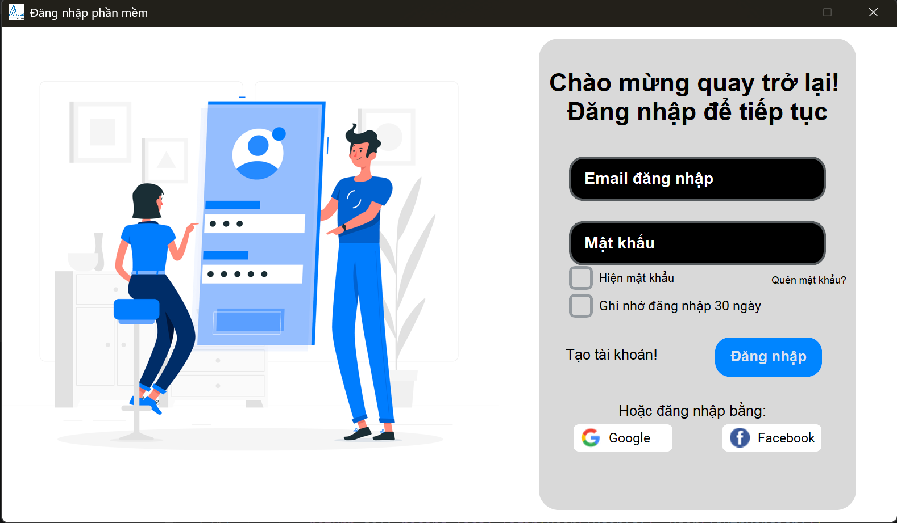

> [!TIP]
> 💡 Các tài khoản đăng nhập theo : Email và Password  
> Hoặc có thể đăng nhập với Google/Facebook  

Phần mềm được phân quyền với 3 mức độ: `Admin`, `User`, `Guest`  

- `Admin`: Được truy cập toàn bộ chức năng  
- `User`: Được truy cập toàn bộ chức năng (Ngoại trừ trang chủ)  
- `Guest`: Giới hạn truy cập một số chức năng cụ thể  

## 1.1 Chức năng tạo tài khoản mới

Nếu chưa có tài khoản thì có thể sử dụng chức năng tạo tài khoản mới để đăng nhập.  

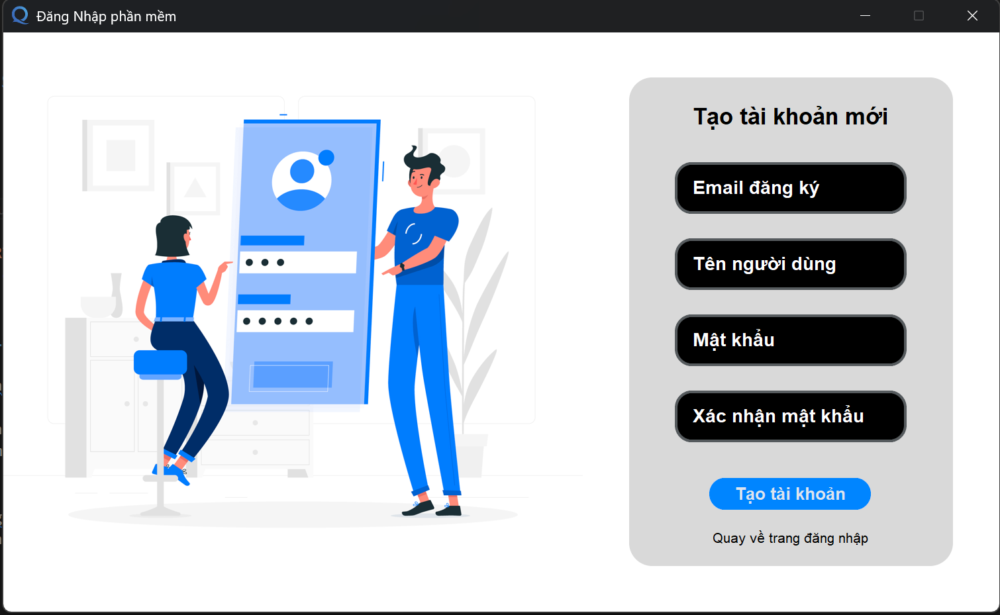  

Sau khi tạo tài khoản xong vẫn `chưa thể đăng nhập` được trừ khi được tài khoản có quyền `admin` kích hoạt tài khoản cho từ tab `Trang chủ`. Xem thêm [tại đây]()  

## 1.2 Chức năng quên mật khẩu  

Khi bạn đã có tài khoản sử dụng nhưng `quên mật khẩu` thì có thể sử dụng chức năng quên mật khẩu từ trang đăng nhập.  

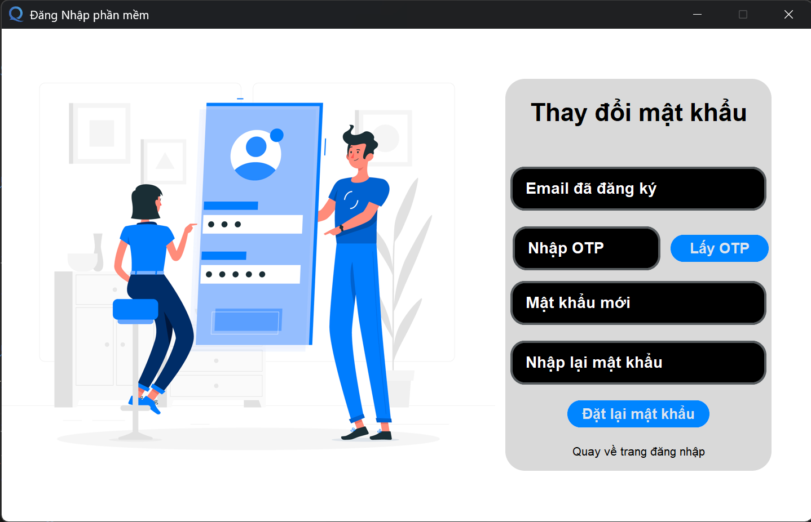

Yêu cầu người dùng nhập `email đã đăng ký` và ấn nút `Lấy OTP` để nhận 1 mã `8 ký tự` thì mới có thể thay đổi mật khẩu. Mã OTP sẽ được gửi tới mail đã đăng ký, thời hạn của mã OTP sẽ là `10 phút`.  

## 2. Trang chủ
Sau khi đăng nhập phần mềm thành công sẽ tiến vào trang chủ `(nếu tài khoản là admin)`  

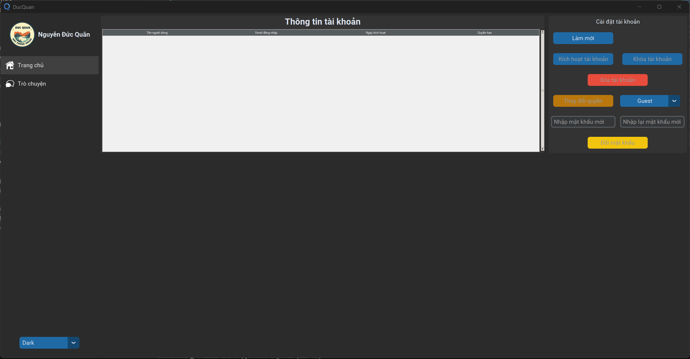

Tại đây có thể `kích hoạt tài khoản`, `Xóa tài khoản`, `Thay đổi quyền hạn`, ...  

# Lập trình phần mềm với Python  

> [!IMPORTANT]  
> **Trước khi đi vào lập trình phần mềm cần lưu ý một số điều sau**  
> **Python**: từ 3.12 trở lên  
> **Database**: SQL Server  
> **Công cụ lập trình**: Visual Studio Code  
> ## Cài đặt driver ODBC cho từng thiết bị sử dụng phần mềm!  

Để chương trình có thể kết nối với `SQL Server` ta cần sử dụng `driver ODBC`. Driver được tải trực tiếp từ `Microsoft`.

Đầu tiên ta cần sao chép dự án này về máy tính, ta có thể download hoặc clone nó về và đặt tên thư mục tương ứng.  
Sau đó mở thư mục này lên và thêm nó vào `workspace` của Visual studio code bằng chức năng `Add Folder To Workspace`. Ta sẽ được như sau:  

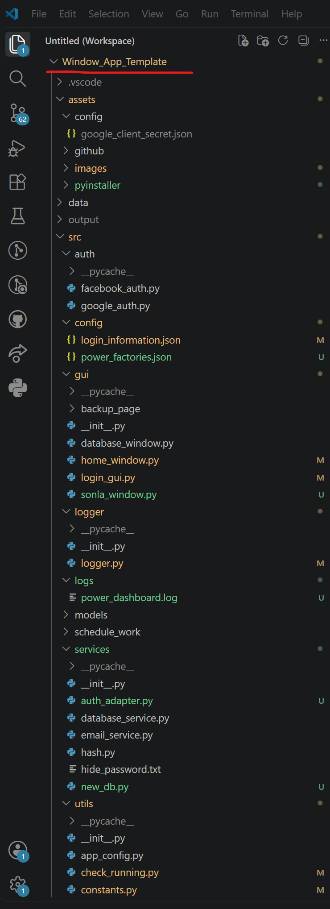

Tất cả các thao tác lệnh được thực hiện trên `Terminal` của `Visual studio code`  

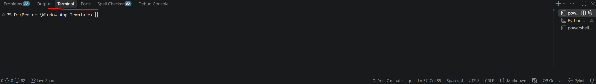

# 1. Tạo môi trường ảo

Để đảm bảo an toàn và tránh cài đặt những thứ không cần thiết vào thư mục gốc của máy tính thì ta sử dụng `môi trường ảo`. Có thể tham khảo về môi trường ảo trong Python tại [github](https://github.com/NguyenDucQuan12/virtual_environment_python) hoặc [youtube](https://youtu.be/FnqKNUp4Htg).  

Chạy lệnh sau để tạo môi trường ảo:  

```python
python -m venv .venv_source --prompt="virtual environment source"
```

Nếu trong máy bạn có nhiều hơn 1 phiên bản Python thì chạy như sau (ví dụ chỉ định cụ thể phiên bản 3.12):  
```python
py -3.12 -m venv .venv_source --prompt="virtual environment source"
```

Kích hoạt môi trường ảo:  
```python
.venv_source\Scripts\activate
```

Cài đặt các thư viện cần thiết:  
```python
python -m pip install -r requirements.txt
```

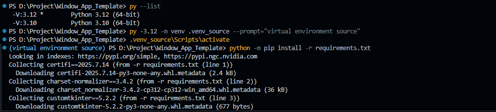

Liệt kê các thư viện đã sử dụng vào tệp `requirements.txt`:  
```python
python -m pip freeze > requirements.txt
```

Khởi động chương trình bằng `Terminal` của `VS code`:  
```python
python src/main.py
```

# 2. Tạo CSDL  

Mở `SQL Server Management Studio (SSMS)` kết nối tới `Database`, rồi chọn `New Query`.  

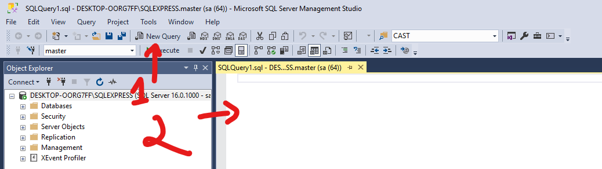

Tất cả các lệnh đều được thực hiện ở đây. Đầu tiên ta cần tạo 1 CSDL trước có tên là `DucQuanApp`.  
```SQL
-- Tạo database mới
CREATE DATABASE DucQuanApp
```

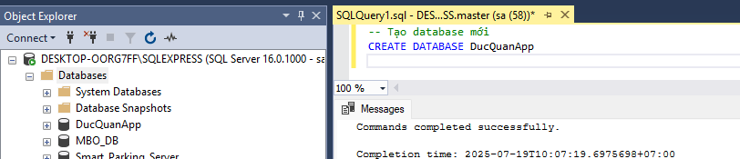

Sau khi tạo xong Database ta cần chuyển đến `DucQuanApp` thì mới có thể thực hiện thao tác đối với CSDL này:  
```SQL
-- Chuyển vào database DucQuanApp
USE DucQuanApp
```
## 2.1 Tạo bảng Users

Ta tiến hành tạo bảng chứa thông tin đăng nhập của người dùng có tên là `Users` và các trường thông tin cần thiết:  
```SQL
CREATE TABLE dbo.Users
(
    UserId VARCHAR(16) NOT NULL,
    UserName NVARCHAR(200) NOT NULL,
    Email NVARCHAR(320) NOT NULL,
    -- OAuth chưa đặt mật khẩu nội bộ: cả hai cột có thể NULL.
    -- Hash tự chứa salt/tham số thì PasswordSalt có thể NULL.
    PasswordHash NVARCHAR(500) NULL,
    PasswordSalt NVARCHAR(500) NULL,
    IsActivate BIT NOT NULL
        CONSTRAINT DF_Users_IsActive DEFAULT (0),
    ActivatedAt DATETIME2(7) NULL,
    Privilege NVARCHAR(50) NOT NULL
        CONSTRAINT DF_Users_Privilege DEFAULT (N'User'),
    Status NVARCHAR(50) NULL,

    CreatedAt DATETIME2(7) NOT NULL
        CONSTRAINT DF_Users_CreatedAt DEFAULT SYSUTCDATETIME(),
    UpdatedAt DATETIME2(7) NOT NULL
        CONSTRAINT DF_Users_UpdatedAt DEFAULT SYSUTCDATETIME(),
    LastLoginAt DATETIME2(7) NULL,
    AuthVersion INT NOT NULL
        CONSTRAINT DF_Users_AuthVersion DEFAULT (1),

    -- Khóa chính
    CONSTRAINT PK_Users PRIMARY KEY (UserId),
    CONSTRAINT UQ_Users_Email UNIQUE (Email)
);
```
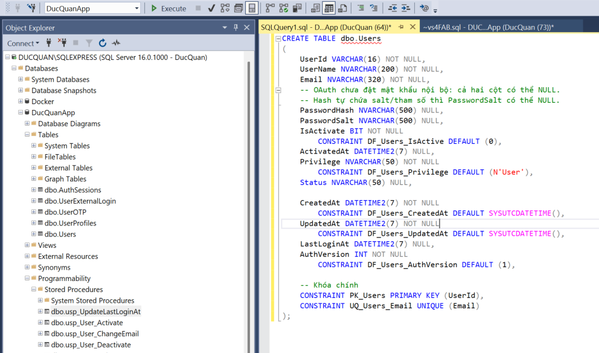

Nếu lúc tạo bảng mà quên thêm ràng buộc cho cột `Email` thì sử dụng lệnh sau:  
```SQL
-- Thêm ràng buộc cho bảng nếu quên lúc tạo
ALTER TABLE Users
ADD CONSTRAINT UQ_Email UNIQUE (Email)
```

Tạo index để tăng tốc độ tìm kiếm dựa trên email người dùng  
```SQL
CREATE UNIQUE INDEX UX_Users_Email
ON dbo.Users(Email);
``` 
# 2.2 Tạo bảng UserProfiles

Ta tạo bảng chứa thông tin người dùng  
```SQL
CREATE TABLE dbo.UserProfiles
(
    UserId VARCHAR(16) NOT NULL,
    FullName NVARCHAR(200) NULL,
    PhoneNumber NVARCHAR(30) NULL,
    DateOfBirth DATE NULL,
    Address NVARCHAR(500) NULL,
    AvatarUrl NVARCHAR(2048) NULL,
    CreatedAt DATETIME2(7) NOT NULL
        CONSTRAINT DF_UserProfiles_CreatedAt DEFAULT SYSUTCDATETIME(),
    UpdatedAt DATETIME2(7) NOT NULL
        CONSTRAINT DF_UserProfiles_UpdatedAt DEFAULT SYSUTCDATETIME(),
    -- Khóa chính
    CONSTRAINT PK_UserProfiles PRIMARY KEY (UserId),
    -- Khóa ngoại và quy tắc xóa: Xóa người dùng ở Users sẽ tự động xóa hồ sơ tương ứng ở UserProfiles
    CONSTRAINT FK_UserProfiles_Users FOREIGN KEY (UserId)
        REFERENCES dbo.Users (UserId) ON DELETE CASCADE
);
```

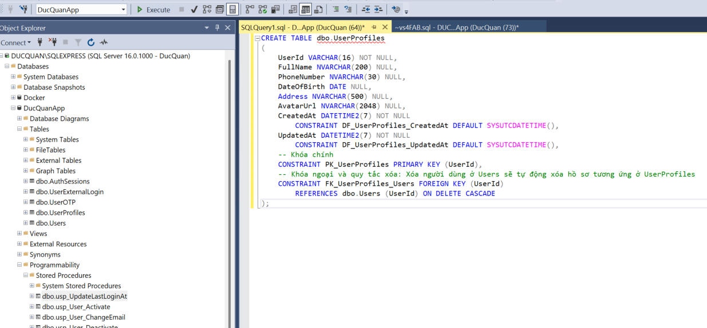

Sau khi đã có bảng `Users` và `UserProfiles` thì thêm 1 dòng dữ liệu ban đầu để đăng nhập:  
```SQL
-- Thêm dữ liệu mới vào bảng
INSERT INTO Users
(
    UserId,
    UserName,
    Email,
    PasswordHash,
    PasswordSalt,
    IsActivate,
    ActivatedAt,
    Privilege,
    Status
)
VALUES (
    'D1203F8451E2D547',
    N'Nguyễn Đức Quân',
    'nguyenducquan2001@gmail.com',
    '152a4a4f24e8481810b9b01c1ef148034f38c17fb40175e29201b767906558f455032735d0f144f052bd10bac553191dbd02c8d3d3c594023c8517ea72f47955',
    'ca5e4c62a549cbe349b5cb78822ad671',
    1,
    GETDATE(), -- Lấy thời gian hiện tại
    'Admin',
    'new account'
)

INSERT INTO UserProfiles
(
    UserId,
    FullName
)
VALUES 
(
    'D1203F8451E2D547',
    N'Nguyễn Đức Quân'
)
```

> Lưu ý giá trị 2 trường `Password` và `Salt_Password` phải tuân thủ cách mã hóa ở [tệp mã hóa](src/services/hash.py).  
> Ví dụ mật khẩu phía trên là: `123456789` 

## 2.3 Tạo bảng AuthSession

Tiếp theo tạo bảng `AuthSession` để lưu trữ các phiên đăng nhập  
```SQL
CREATE TABLE dbo.AuthSessions
(
    SessionId BIGINT IDENTITY(1,1) NOT NULL CONSTRAINT PK_AuthSessions PRIMARY KEY,
    UserId VARCHAR(16) NOT NULL,
    UserEmail NVARCHAR(256) NOT NULL,
    AuthVersion INT NOT NULL,
    TokenHash BINARY(32) NOT NULL,
    DeviceInfo NVARCHAR(256) NULL,
    CreatedAt DATETIME2(7) NOT NULL CONSTRAINT DF_AuthSessions_CreatedAt DEFAULT SYSUTCDATETIME(),
    ExpiresAt DATETIME2(7) NOT NULL,
    RevokedAt DATETIME2(7) NULL,
    -- Định nghĩa các Ràng buộc (Constraints)
    CONSTRAINT UQ_AuthSessions_TokenHash UNIQUE(TokenHash),
    -- Khi xóa tài khoản ở Users thì cũng xóa các dòng ở AuthSession
    CONSTRAINT FK_AuthSessions_Users FOREIGN KEY(UserId)
        REFERENCES dbo.Users(UserId) ON DELETE CASCADE,
    CONSTRAINT CK_AuthSessions_AuthVersion CHECK(AuthVersion>=1),
    CONSTRAINT CK_AuthSessions_Expires CHECK(ExpiresAt>CreatedAt)
);

-- 2. Tạo các chỉ mục (Indexes) tối ưu hiệu năng
-- Index tìm kiếm phiên hoạt động theo User và sắp xếp theo Session mới nhất
CREATE INDEX IX_AuthSession_UserActive 
    ON dbo.AuthSessions (UserEmail, SessionId DESC)
    INCLUDE (ExpiresAt, CreatedAt, DeviceInfo) 
    WHERE RevokedAt IS NULL;

-- Index phục vụ cho việc dọn dẹp các token đã hết hạn (Cron job/Clean up)
CREATE INDEX IX_AuthSession_Expiry 
    ON dbo.AuthSessions (ExpiresAt);

-- Index phục vụ tìm kiếm các phiên đã bị hủy (Filtered Index)
CREATE INDEX IX_AuthSession_Revoked 
    ON dbo.AuthSessions (RevokedAt) 
    WHERE RevokedAt IS NOT NULL;
```

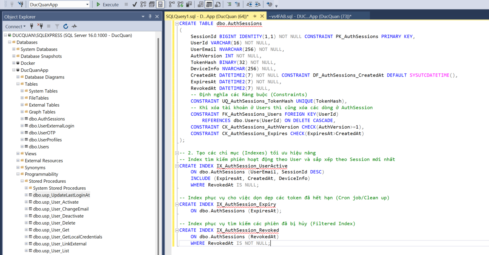

## 2.4 Tạo bảng UserOTP
Tạo bảng này chứa thông tin mã OTP  
```SQL
CREATE TABLE dbo.UserOTP
(
    UserId VARCHAR(16) NOT NULL,
    Purpose NVARCHAR(100) NOT NULL,
    ChallengeId VARCHAR(32) NOT NULL,
    CodeHash BINARY(32) NOT NULL,
    AuthVersion INT NOT NULL,
    Attempts INT NOT NULL CONSTRAINT DF_UserOTP_Attempts DEFAULT(0),
    CreatedAt DATETIME2(7) NOT NULL CONSTRAINT DF_UserOTP_CreatedAt DEFAULT SYSUTCDATETIME(),
    ExpiresAt DATETIME2(7) NOT NULL,
    ConsumedAt DATETIME2(7) NULL,
    CONSTRAINT PK_UserOTP PRIMARY KEY(UserId,Purpose),
    CONSTRAINT FK_UserOTP_Users FOREIGN KEY(UserId)
        REFERENCES dbo.Users(UserId) ON DELETE CASCADE,
    CONSTRAINT CK_UserOTP_Attempts CHECK(Attempts BETWEEN 0 AND 5),
    CONSTRAINT CK_UserOTP_AuthVersion CHECK(AuthVersion>=1),
    CONSTRAINT CK_UserOTP_Expires CHECK(ExpiresAt>CreatedAt)
);
```

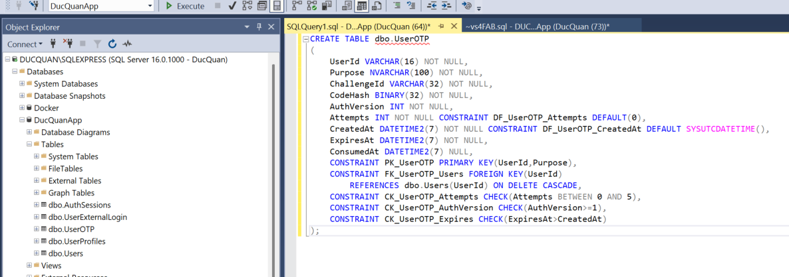

## 2.5 Tạo bảng UserExternalLogin
Tạo bảng này lưu trữ thông tin người dùng đăng nhập bằng nhà cung cấp thứ ba như `Google` hoặc `Facebook`  
```SQL
CREATE TABLE dbo.UserExternalLogin
(
    UserId VARCHAR(16) NOT NULL,
    UserEmail NVARCHAR(320) NOT NULL,
    Provider NVARCHAR(50) NOT NULL,
    -- BIN2 giúp so sánh định danh theo quy tắc nhị phân, phân biệt chữ hoa và chữ thường
    ProviderUserId NVARCHAR(255) COLLATE Latin1_General_100_BIN2 NOT NULL,
    ProviderEmail NVARCHAR(320) NULL,
    CreatedAt DATETIME2(7) NOT NULL,
    UpdatedAt DATETIME2(7) NOT NULL,

    -- Khóa chính
    CONSTRAINT PK_UserExternalLogin PRIMARY KEY (Provider, ProviderUserId),
    -- Khóa ngoại và quy tắc xóa: Xóa userId ở User sẽ xóa dòng tương ứng ở UserExternalLogin
    CONSTRAINT FK_UserExternalLogin_Users FOREIGN KEY (UserId)
        REFERENCES dbo.Users (UserId) ON DELETE CASCADE
);
```
Tạo index  
```SQL
CREATE UNIQUE INDEX UX_ExternalLogin_Provider_ProviderUserId
ON dbo.UserExternalLogin(Provider, ProviderUserId);
```


## 2.6 Tạo các procedure

### 1. Procedure lấy thông tin chi tiết 1 người
Procedure rả về HAI result set gồm thông tin chung/hồ sơ và các phương thức Google/Facebook đã liên kết  
```SQL
USE [DucQuanApp]
GO
CREATE OR ALTER PROCEDURE dbo.usp_User_Get
    @UserId VARCHAR(16)=NULL, @Email NVARCHAR(320)=NULL
AS
BEGIN
    SET NOCOUNT ON;
    -- Xác định tài khoản ngay trong procedure, không gọi hàm phụ.
    -- Chuỗi rỗng coi là không truyền. Nếu có cả ID/email thì ID ưu tiên.
    SET @UserId=NULLIF(LTRIM(RTRIM(@UserId)),'');
    SET @Email=NULLIF(LOWER(LTRIM(RTRIM(@Email))),N'');
    DECLARE @Id VARCHAR(16)=NULL;
    DECLARE @EmailMatches BIGINT=0;
    IF @UserId IS NOT NULL
    BEGIN
        SELECT @Id=u.UserId FROM dbo.Users AS u WHERE u.UserId=@UserId;
    END
    ELSE IF @Email IS NOT NULL
    BEGIN
        -- Một lần SELECT lấy ID và số dòng khớp, không chọn bừa nếu email trùng.
        SELECT @Id=MIN(u.UserId),@EmailMatches=COUNT_BIG(*)
        FROM dbo.Users AS u
        WHERE LOWER(LTRIM(RTRIM(u.Email)))=@Email COLLATE Latin1_General_100_CI_AS;
        IF @EmailMatches>1
            THROW 51117,N'Email khớp nhiều tài khoản; cần xử lý dữ liệu trùng hoặc dùng UserId.',1;
    END
    -- ID không tồn tại không được chuyển sang tìm một email khác.
    IF @Id IS NULL THROW 51100,N'Không tìm thấy tài khoản hoặc thiếu UserId/Email.',1;
    SELECT u.UserId,u.UserName,u.Email,p.FullName,p.PhoneNumber,p.DateOfBirth,
           p.Address,p.AvatarUrl,u.IsActivate,u.ActivatedAt,u.Privilege,u.Status,
           u.CreatedAt,u.UpdatedAt,u.LastLoginAt,p.CreatedAt AS ProfileCreatedAt,
           p.UpdatedAt AS ProfileUpdatedAt,u.AuthVersion,
           CONVERT(BIT,CASE WHEN u.PasswordHash IS NULL THEN 0 ELSE 1 END) AS HasLocalPassword
    FROM dbo.Users AS u
    LEFT JOIN dbo.UserProfiles AS p ON p.UserId=u.UserId
    WHERE u.UserId=@Id;
    SELECT Provider,ProviderUserId,ProviderEmail,CreatedAt,UpdatedAt
    FROM dbo.UserExternalLogin WHERE UserId=@Id ORDER BY Provider,ProviderUserId;
END;
```
Ví dụ sử dụng:  
```SQL
EXEC dbo.usp_User_Get @Email=N' QUAN@EXAMPLE.COM ';
EXEC dbo.usp_User_Get @UserId='0123456789ABCDEF';
-- Có cả hai thì dùng ID; ID không có thì không chuyển sang email khác.
EXEC dbo.usp_User_Get @UserId='0123456789ABCDEF',@Email=N'khac@example.com';
```
### 2. Danh sách người dùng sử dụng phân trang
Nếu không truyền ID/email: lấy danh sách.  
Có ID: chỉ lọc ID, bỏ qua email.  
Có email mà không có ID: khớp email chính xác; không tìm theo email provider.  
Kết quả TotalRows là tổng trước phân trang, result set thứ hai là dữ liệu trang.  

```SQL
USE [DucQuanApp]
GO
CREATE OR ALTER PROCEDURE dbo.usp_User_List
    @UserId VARCHAR(16)=NULL, @Email NVARCHAR(320)=NULL,
    @PageNumber INT=1, @PageSize INT=20
AS
BEGIN
    SET NOCOUNT ON;
    IF @PageNumber IS NULL OR @PageNumber<1 OR @PageSize IS NULL OR @PageSize<1 OR @PageSize>200
        THROW 51101,N'Trang phải >=1; số dòng mỗi trang từ 1 đến 200.',1;
    -- Xác định tài khoản ngay trong procedure, không gọi hàm phụ.
    -- Chuỗi rỗng coi là không truyền. Nếu có cả ID/email thì ID ưu tiên.
    SET @UserId=NULLIF(LTRIM(RTRIM(@UserId)),'');
    SET @Email=NULLIF(LOWER(LTRIM(RTRIM(@Email))),N'');
    DECLARE @Id VARCHAR(16)=NULL;
    DECLARE @EmailMatches BIGINT=0;
    IF @UserId IS NOT NULL
    BEGIN
        SELECT @Id=u.UserId FROM dbo.Users AS u WHERE u.UserId=@UserId;
    END
    ELSE IF @Email IS NOT NULL
    BEGIN
        -- Một lần SELECT lấy ID và số dòng khớp, không chọn bừa nếu email trùng.
        SELECT @Id=MIN(u.UserId),@EmailMatches=COUNT_BIG(*)
        FROM dbo.Users AS u
        WHERE LOWER(LTRIM(RTRIM(u.Email)))=@Email COLLATE Latin1_General_100_CI_AS;
        IF @EmailMatches>1
            THROW 51117,N'Email khớp nhiều tài khoản; cần xử lý dữ liệu trùng hoặc dùng UserId.',1;
    END
    -- ID không tồn tại không được chuyển sang tìm một email khác.
    DECLARE @All BIT=CASE WHEN @UserId IS NULL AND @Email IS NULL THEN 1 ELSE 0 END;
    SELECT COUNT_BIG(*) AS TotalRows FROM dbo.Users WHERE @All=1 OR UserId=@Id;
    SELECT u.UserId,u.UserName,u.Email,p.FullName,p.PhoneNumber,p.DateOfBirth,
           p.Address,p.AvatarUrl,u.IsActivate,u.ActivatedAt,u.Privilege,u.Status,
           u.CreatedAt,u.UpdatedAt,u.LastLoginAt,p.CreatedAt AS ProfileCreatedAt,
           p.UpdatedAt AS ProfileUpdatedAt,u.AuthVersion,
           CONVERT(BIT,CASE WHEN u.PasswordHash IS NULL THEN 0 ELSE 1 END) AS HasLocalPassword
    FROM dbo.Users AS u
    LEFT JOIN dbo.UserProfiles AS p ON p.UserId=u.UserId
    WHERE @All=1 OR u.UserId=@Id
    ORDER BY u.CreatedAt DESC,u.UserId
    OFFSET (CONVERT(BIGINT,@PageNumber)-1)*@PageSize ROWS FETCH NEXT @PageSize ROWS ONLY;
END;
```
Ví dụ sử dụng:  
`result set 1 TotalRows, result set 2 trang dữ liệu.`
```SQL
EXEC dbo.usp_User_List @PageNumber=1,@PageSize=20;
EXEC dbo.usp_User_List @Email=N'quan@example.com';
```
### 3. Tạo tài khoản đăng nhập nội bộ và hồ sơ người dùng
Thu thập dữ liệu nghiệp vụ về thông tin người dùng và thông tin đăng nhập  
Ghi nhiều bảng trong cùng transaction: hoặc hoàn thành hết, hoặc rollback hết. Application lock ngăn hai procedure ghi trong bộ này tranh chấp tạo/liên kết.  

```SQL
USE [DucQuanApp]
GO

/* Tạo tài khoản nội bộ và hồ sơ.
   Thu thập dữ liệu nghiệp vụ; UserId/thời gian/quyền/trạng thái do hệ thống đặt.
   Không cho người đăng ký tự chọn quyền Admin hay trạng thái kích hoạt.
   Tài khoản ban đầu IsActivate=0; gọi Activate sau bước xác minh/phê duyệt.
   FullName bắt buộc ở luồng này; SĐT/ngày sinh/địa chỉ/ảnh có thể bổ sung sau.
   Ghi nhiều bảng trong cùng transaction: hoặc hoàn thành hết, hoặc rollback hết.
   Application lock ngăn hai procedure ghi trong bộ này tranh chấp tạo/liên kết.
*/
CREATE OR ALTER PROCEDURE [dbo].[usp_User_RegisterLocal]

	-- Các trường thông tin ghi vào CSDL
    @Email NVARCHAR(320), 
	@UserName NVARCHAR(200), 
	@PasswordHash NVARCHAR(500),
	@PasswordSalt NVARCHAR(500)=NULL,
    @FullName NVARCHAR(200), 
	@PhoneNumber NVARCHAR(30)=NULL,
    @DateOfBirth DATE=NULL, 
	@Address NVARCHAR(500)=NULL,
    @AvatarUrl NVARCHAR(2048)=NULL
AS
BEGIN
    SET NOCOUNT ON;
    SET XACT_ABORT ON;
    IF @@TRANCOUNT<>0 THROW 51102,N'Procedure cần kết nối không có transaction bao ngoài.',1;

	-- Tạo bảng Result chứa kết quả sau cùng
    DECLARE @Result TABLE (
        UserId VARCHAR(16),UserName NVARCHAR(200),Email NVARCHAR(320),
        FullName NVARCHAR(200),PhoneNumber NVARCHAR(30),DateOfBirth DATE,
        Address NVARCHAR(500),AvatarUrl NVARCHAR(2048),IsActivate BIT,
        ActivatedAt DATETIME2(7),Privilege NVARCHAR(50),Status NVARCHAR(50),
        CreatedAt DATETIME2(7),UpdatedAt DATETIME2(7),LastLoginAt DATETIME2(7),
        ProfileCreatedAt DATETIME2(7),ProfileUpdatedAt DATETIME2(7),
        AuthVersion INT,HasLocalPassword BIT);

    BEGIN TRY
        BEGIN TRANSACTION;

		-- Tạo khóa và lấy khóa để tiến hành
        DECLARE @LockResult INT;
        EXEC @LockResult=sys.sp_getapplock @Resource=N'UserManagement.Write',
            @LockMode=N'Exclusive',@LockOwner=N'Transaction',@LockTimeout=10000;
        IF @LockResult<0 THROW 51103,N'Không lấy được khóa cập nhật; thử lại có giới hạn.',1;

		-- Lấy thời gian hiện tại
        DECLARE @Now DATETIME2(7)=SYSUTCDATETIME();
		-- Xác thực lại địa chỉ email
        SET @Email=NULLIF(LOWER(LTRIM(RTRIM(@Email))),N'');
        IF @Email IS NULL OR @Email NOT LIKE N'%_@_%._%'
            THROW 51105,N'Email không hợp lệ.',1;

		-- Kiểm tra xem địa chỉ email này đã đăng ký chưa
        IF EXISTS(SELECT 1 FROM dbo.Users WHERE LOWER(LTRIM(RTRIM(Email)))=@Email COLLATE Latin1_General_100_CI_AS)
            THROW 51106,N'Email đã có tài khoản. Không thể đăng ký mới.',1;


		-- Chuẩn hóa lại tên người dùng
        SET @UserName=NULLIF(LTRIM(RTRIM(@UserName)),N'');
        SET @FullName=NULLIF(LTRIM(RTRIM(@FullName)),N'');

		-- Xác thực tên và mật khẩu
        IF @UserName IS NULL OR @FullName IS NULL OR NULLIF(LTRIM(RTRIM(@PasswordHash)),N'') IS NULL
            THROW 51107,N'Phải có tên hiển thị, họ tên và hash mật khẩu.',1;

        IF @DateOfBirth>CONVERT(DATE,@Now) THROW 51108,N'Ngày sinh không được ở tương lai.',1;

		-- Sinh 8 byte ngẫu nhiên thành 16 ký tự HEX. Không cắt GUID.
        DECLARE @Id VARCHAR(16);
        SET @Id=CONVERT(VARCHAR(16),CRYPT_GEN_RANDOM(8),2);
		-- Kiểm tra lại để xử lý va chạm; PK vẫn là lớp bảo vệ cuối cùng.
        WHILE EXISTS(SELECT 1 FROM dbo.Users WHERE UserId=@Id)
            SET @Id=CONVERT(VARCHAR(16),CRYPT_GEN_RANDOM(8),2);

		-- Thêm bản ghi dữ liệu đăng nhập cho người dùng
        INSERT dbo.Users
				(UserId, UserName, Email, PasswordHash, PasswordSalt, IsActivate,
				ActivatedAt, Privilege, Status, CreatedAt, UpdatedAt)
        VALUES
				(@Id, @UserName, @Email, @PasswordHash, @PasswordSalt, 0, NULL, N'User', NULL, @Now, @Now);

		-- Thêm bản ghi cho dữ liệu cá nhân người dùng
        INSERT dbo.UserProfiles
				(UserId, FullName, PhoneNumber, DateOfBirth, Address, AvatarUrl, CreatedAt, UpdatedAt)
        VALUES
				(@Id, @FullName, NULLIF(LTRIM(RTRIM(@PhoneNumber)), N''), @DateOfBirth, NULLIF(LTRIM(RTRIM(@Address)), N''), NULLIF(LTRIM(RTRIM(@AvatarUrl)), N''), @Now, @Now);

        -- Gán kết quả vào bảng Result để trả thông tin về cho người dùng
        INSERT @Result SELECT u.UserId,u.UserName,u.Email,p.FullName,p.PhoneNumber,p.DateOfBirth,
               p.Address,p.AvatarUrl,u.IsActivate,u.ActivatedAt,u.Privilege,u.Status,
               u.CreatedAt,u.UpdatedAt,u.LastLoginAt,p.CreatedAt AS ProfileCreatedAt,
               p.UpdatedAt AS ProfileUpdatedAt,u.AuthVersion,
               CONVERT(BIT,CASE WHEN u.PasswordHash IS NULL THEN 0 ELSE 1 END) AS HasLocalPassword

        FROM dbo.Users AS u
        LEFT JOIN dbo.UserProfiles AS p ON p.UserId=u.UserId
        WHERE u.UserId=@Id;

        COMMIT;
    END TRY
    BEGIN CATCH
        IF XACT_STATE()<>0 ROLLBACK;
        THROW; -- Giữ mã lỗi gốc để backend xử lý đúng nguyên nhân.
    END CATCH;
    SELECT * FROM @Result;
END;
```
Ví dụ sử dụng:  
```SQL
DECLARE @Hash NVARCHAR(500)=N'<HASH_THAT_TU_BACKEND>';
EXEC dbo.usp_User_RegisterLocal
@Email=N'quan@example.com',@UserName=N'Đức Quân',@PasswordHash=@Hash,
@FullName=N'Nguyễn Đức Quân',@PhoneNumber=N'0901234567',
@DateOfBirth='1995-06-20',@Address=N'Hà Nội',@AvatarUrl=NULL;
```
### 4. Tạo tài khoản mới khi đăng nhập bằng Google hoặc Facebook

Khi người dùng sử dụng chức năng đăng nhập bằng mạng xã hội như `Facebook` hoặc `Google` sẽ có các trường hợp sau:  
Ví dụ với `google`  

1. Người dùng đã có tài khoản nhưng chưa liên kết với google
Ban đầu người dùng tạo tài khoản trên phần mềm, họ đã có `tài khoản nội bộ` dùng để đăng nhập. Lần sau họ đăng nhập thì họ sử dụng tài khoản google thì ta cần thông báo cho họ đăng nhập bằng tài khoản nội bộ và tiến hành liên kết tài khoản google với tài khoản này, không tự động liên kết mail này với tài khoản nội bộ.  

2. Người dùng đã có tài khoản và đã liên kết với tài khoản google
Với người dùng đã có tài khoản nội bộ và đã liên kết với tài khoản google thì khi họ sử dụng bất kỳ cách đăng nhập nào thì cũng tiến hành đăng nhập cho họ. Dựa vào `Provider` + `ProviderUserId` để tìm, không phụ thuộc email  

3. Người dùng hoàn toàn mới  
Đây là lần đầu họ đăng nhập phần mềm, vì vậy khi họ đăng nhập bằng tài khoản Google thì ta cần tạo cho họ một tài khoản nội bộ dùng để đăng nhập bình thường, nhưng mật khẩu để `NULL`, và liên kết tài khoản nội bộ đó với tài khoản google này. Sau đó thông báo người dùng cần đợi Admin kích hoạt tài khoản này để sử dụng.  

SQL dưới đây giải quyết các vấn đề trên.  
```SQL
USE [DucQuanApp];
GO
SET ANSI_NULLS ON;
GO
SET QUOTED_IDENTIFIER ON;
GO

/*
Đăng nhập Google/Facebook SAU khi backend xác thực token.
result_code là KẾT QUẢ
LINK_REQUIRED: định danh ngoài chưa liên kết nhưng email chính đã tồn tại.
CREATED_PENDING: đã tạo đủ ba bảng, quyền User, IsActivate=0, chờ duyệt.
ACCOUNT_INACTIVE: định danh đã liên kết nhưng tài khoản có IsActivate=0.
LOGIN_ALLOWED: định danh đã liên kết và tài khoản có IsActivate=1.
*/
CREATE OR ALTER PROCEDURE dbo.usp_User_LoginExternal
    @Provider NVARCHAR(50),
    @ProviderUserId NVARCHAR(255),
    @AccountEmail NVARCHAR(320) = NULL,
    @ProviderEmail NVARCHAR(320) = NULL,
    @UserName NVARCHAR(200) = NULL,
    @FullName NVARCHAR(200) = NULL,
    @PhoneNumber NVARCHAR(30) = NULL,
    @DateOfBirth DATE = NULL,
    @Address NVARCHAR(500) = NULL,
    @AvatarUrl NVARCHAR(2048) = NULL
AS
BEGIN
    SET NOCOUNT ON;
    SET XACT_ABORT ON;
    IF @@TRANCOUNT <> 0
        THROW 51102, N'Procedure cần kết nối không có transaction bao ngoài.', 1;

    DECLARE @ResultCode NVARCHAR(32) = NULL;
    DECLARE @Id VARCHAR(16) = NULL;
    DECLARE @Email NVARCHAR(320) = NULL;
    DECLARE @IsActivate BIT = NULL;

	-- Bảng kết quả trả về kết quả cùng @Result_code
	-- Chỉ trả về các tham số trong bảng này theo thứ tự khai báo ở hàm SELECT cuối cùng
    DECLARE @Result TABLE
    (
        UserId VARCHAR(16), UserName NVARCHAR(200), Email NVARCHAR(320),
        FullName NVARCHAR(200), Privilege NVARCHAR(50), IsActivate BIT,
        Provider NVARCHAR(200), ProviderUserId NVARCHAR(255), AuthVersion INT
    );

    BEGIN TRY
        BEGIN TRANSACTION;

        -- Cùng tên khóa với các procedure quản lý người dùng còn lại để tránh race condition
        DECLARE @LockResult INT;
        EXEC @LockResult = sys.sp_getapplock
            @Resource = N'UserManagement.Write',
            @LockMode = N'Exclusive',
            @LockOwner = N'Transaction',
            @LockTimeout = 10000;

        IF @LockResult < 0
            THROW 51103, N'Không lấy được khóa cập nhật; thử lại có giới hạn.', 1;
		
		-- Lấy thời gian hiện tại
        DECLARE @Now DATETIME2(7) = SYSUTCDATETIME();
        SET @Provider = LOWER(LTRIM(RTRIM(@Provider)));
		-- Xác thực Provider chỉ cho phép là Google/Facebook
        IF @Provider IS NULL
           OR @Provider NOT IN (N'google', N'facebook')
           OR NULLIF(LTRIM(RTRIM(@ProviderUserId)), N'') IS NULL
            THROW 51109, N'Provider/ProviderUserId không hợp lệ.', 1;

        -- Tìm kiếm trên DB xem có người dùng nào đã kết nối tới Provider và có ID không
        SELECT @Id = e.UserId
        FROM dbo.UserExternalLogin AS e
        WHERE e.Provider = @Provider
          AND e.ProviderUserId = @ProviderUserId COLLATE Latin1_General_100_BIN2;

		-- Nếu có UserId thỏa mãn thì tức là đã liên kết với Google/Facebook
        IF @Id IS NOT NULL
        BEGIN
            -- Kiểm tra xem người dùng có bị khóa hay không
            SELECT @IsActivate = u.IsActivate
            FROM dbo.Users AS u
            WHERE u.UserId = @Id;

            -- Bình thường FK đã ngăn trường hợp này; nếu có thì là lỗi dữ liệu.
            IF @IsActivate IS NULL
                THROW 51100, N'Liên kết không có tài khoản Users hợp lệ.', 1;

			-- IsActivate = 0 nghĩa là đang bị khóa tài khoản, trả thông báo tới người dùng
			-- Không cập nhật LastLoginAt, không tự kích hoạt lại.
            IF @IsActivate = 0
            BEGIN
                SET @ResultCode = N'ACCOUNT_INACTIVE';
            END
			-- Cón nếu không bị khóa thì cho phép đăng nhập
            ELSE
            BEGIN
                SET @ResultCode = N'LOGIN_ALLOWED';

				-- Cập nhật lại email của người dùng với email từ Provide
                UPDATE dbo.UserExternalLogin
                SET ProviderEmail = @ProviderEmail,
                    UpdatedAt = @Now
                WHERE Provider = @Provider
                  AND ProviderUserId = @ProviderUserId COLLATE Latin1_General_100_BIN2;

				-- Cập nhật thời gian login
                UPDATE dbo.Users
                SET LastLoginAt = @Now
                WHERE UserId = @Id;
            END;
        END
		-- Nếu không tìm thấy người dùng thì có nghĩa là người dùng chưa liên kết với Google/Facebook
        ELSE
        BEGIN
            -- Xác thực email trả về từ nhà cung cấp
            SET @Email = NULLIF(LOWER(LTRIM(RTRIM(@ProviderEmail))), N'');

            IF @Email IS NULL OR @Email NOT LIKE N'%_@_%._%'
                BEGIN
					-- Tạo chuỗi thông báo lỗi chứa cả giá trị thực tế của @Email
					DECLARE @ErrorMessage NVARCHAR(2048);
					SET @ErrorMessage = FORMATMESSAGE(N'Email không hợp lệ. Giá trị nhận được: "%s"', ISNULL(@ProviderEmail, N'NULL'));
					-- Throw lỗi ra ngoài
					THROW 51105, @ErrorMessage, 1;
				END;

			-- Nếu tồn tại thông tin người dùng trong DB, có nghĩa là trước đây đã đăng nhập bằng tài khoản nội bộ, bây giừo sử dụng liên kết với Google/Facebook
            IF EXISTS
            (
                SELECT 1 FROM dbo.Users
                WHERE LOWER(LTRIM(RTRIM(Email))) =
                      @Email COLLATE Latin1_General_100_CI_AS
            )
            BEGIN
                SET @ResultCode = N'LINK_REQUIRED';
                -- Không tự liên kết, không trả hồ sơ của tài khoản trùng email.
            END
			-- Nếu không tồn tại thông tin có nghĩa là tài khoản này mới tinh, thực hiện tạo hồ sơ ban đầu cho tài khoản này
            ELSE
            BEGIN
				-- Xác thực ngày sinh
                IF @DateOfBirth > CONVERT(DATE, @Now)
                    THROW 51108, N'Ngày sinh không được ở tương lai.', 1;
				-- Validation họ tên người dùng
				SET @UserName = COALESCE(
                    NULLIF(LTRIM(RTRIM(@UserName)), N''),
                    NULLIF(LTRIM(RTRIM(@FullName)), N''),
                    N'Người dùng'
                );
				-- Nếu không có tên thì lấy tên từ tài khoản google cung cấp
				IF @FullName IS NULL
					SET @FullName = @UserName;

                -- Sinh ID ngẫu nhiên 16 ký tự; PK bảo vệ tính duy nhất.
                SET @Id = CONVERT(VARCHAR(16), CRYPT_GEN_RANDOM(8), 2);
				-- Kiểm tra lại lần nữa ID này đã tồn tại trong DB chưa, nếu đã có thì tiếp tục tạo mới ID cho đến khi không trùng
                WHILE EXISTS (SELECT 1 FROM dbo.Users WHERE UserId = @Id)
                    SET @Id = CONVERT(VARCHAR(16), CRYPT_GEN_RANDOM(8), 2);

                -- Tạo thông tin đăng nhập, với quyền mặc định 'User' và chưa kích hoạt
                INSERT dbo.Users
                (
                    UserId, UserName, Email, PasswordHash, PasswordSalt,
                    IsActivate, ActivatedAt, Privilege, Status,
                    CreatedAt, UpdatedAt, LastLoginAt
                )
                VALUES
                (
                    @Id, @UserName, @Email, NULL, NULL,
                    0, NULL, N'User', NULL,
                    @Now, @Now, NULL
                );
				-- Tạo thông tin hồ sơ người dùng
                INSERT dbo.UserProfiles
                (
                    UserId, FullName, PhoneNumber, DateOfBirth,
                    Address, AvatarUrl, CreatedAt, UpdatedAt
                )
                VALUES
                (
                    @Id, NULLIF(LTRIM(RTRIM(@FullName)), N''),
                    NULLIF(LTRIM(RTRIM(@PhoneNumber)), N''), @DateOfBirth,
                    NULLIF(LTRIM(RTRIM(@Address)), N''),
                    NULLIF(LTRIM(RTRIM(@AvatarUrl)), N''), @Now, @Now
                );
				-- Tạo thông tin đăng nhập bằng Google/Facebook
                INSERT dbo.UserExternalLogin
                (
                    UserId, UserEmail, Provider, ProviderUserId,
                    ProviderEmail, CreatedAt, UpdatedAt
                )
                VALUES
                (
                    @Id, @Email, @Provider, @ProviderUserId,
                    @ProviderEmail, @Now, @Now
                );

                SET @ResultCode = N'CREATED_PENDING';
            END;
        END;

        -- Nếu cho phép đăng nhập hoặc vừa tạo tài khoản thì lấy thông tin ra trả về cho người dùng
        IF @ResultCode IN (N'LOGIN_ALLOWED', N'CREATED_PENDING')
        BEGIN
            INSERT @Result
            SELECT
                u.UserId, u.UserName, u.Email,
                p.FullName, u.Privilege, u.IsActivate,
				e.Provider, e.ProviderUserId, u.AuthVersion
            FROM dbo.Users AS u
            LEFT JOIN dbo.UserProfiles AS p ON p.UserId = u.UserId
            LEFT JOIN dbo.UserExternalLogin AS e ON e.UserId = u.UserId
            WHERE u.UserId = @Id;
        END;

        COMMIT TRANSACTION;
    END TRY
    BEGIN CATCH
        IF XACT_STATE() <> 0
            ROLLBACK TRANSACTION;
        THROW; -- Giữ lỗi dữ liệu đầu vào/lỗi SQL; không giả làm thành công.
    END CATCH;

    -- Trả về Result_code để biết kết quả
    -- Nếu @Result rỗng, các cột hồ sơ NULL nhưng result_code vẫn có giá trị.
    SELECT code.result_code, detail.*
    FROM (VALUES (@ResultCode)) AS code(result_code)
    LEFT JOIN @Result AS detail ON 1 = 1;
END;
```
Ví dụ sử dụng:  
```SQL
EXEC dbo.usp_User_LoginExternal
@Provider=N'google',@ProviderUserId=N'<SUB_GOOGLE_DA_XAC_THUC>',
@AccountEmail=N'lan@example.com',@ProviderEmail=N'lan@example.com',
@UserName=N'Lan',@FullName=N'Nguyễn Thị Lan';
-- Tài khoản mới: IsNewUser=1, IsActivate=1, Status=NULL; tạo cả 3 bảng.
-- Lần sau: không cần AccountEmail, nhận IsNewUser=0.
EXEC dbo.usp_User_LoginExternal
@Provider=N'google',@ProviderUserId=N'<SUB_GOOGLE_DA_XAC_THUC>',
@ProviderEmail=N'lan@example.com';
```
### 5. Cập nhật hồ sơ người dùng

```SQL
USE [DucQuanApp]
GO
CREATE OR ALTER PROCEDURE dbo.usp_User_UpdateProfile
    @UserId VARCHAR(16)=NULL, @Email NVARCHAR(320)=NULL,
    @UserName NVARCHAR(200)=NULL,
    @FullName NVARCHAR(200)=NULL, @SetFullName BIT=0,
    @PhoneNumber NVARCHAR(30)=NULL, @SetPhoneNumber BIT=0,
    @DateOfBirth DATE=NULL, @SetDateOfBirth BIT=0,
    @Address NVARCHAR(500)=NULL, @SetAddress BIT=0,
    @AvatarUrl NVARCHAR(2048)=NULL, @SetAvatarUrl BIT=0
AS
BEGIN
    SET NOCOUNT ON;
    SET XACT_ABORT ON;
    IF @@TRANCOUNT<>0 THROW 51102,N'Procedure cần kết nối không có transaction bao ngoài.',1;
    DECLARE @Result TABLE (
        UserId VARCHAR(16),UserName NVARCHAR(200),Email NVARCHAR(320),
        FullName NVARCHAR(200),PhoneNumber NVARCHAR(30),DateOfBirth DATE,
        Address NVARCHAR(500),AvatarUrl NVARCHAR(2048),IsActivate BIT,
        ActivatedAt DATETIME2(7),Privilege NVARCHAR(50),Status NVARCHAR(50),
        CreatedAt DATETIME2(7),UpdatedAt DATETIME2(7),LastLoginAt DATETIME2(7),
        ProfileCreatedAt DATETIME2(7),ProfileUpdatedAt DATETIME2(7),
        AuthVersion INT,HasLocalPassword BIT);
    BEGIN TRY
        BEGIN TRANSACTION;
        DECLARE @LockResult INT;
        EXEC @LockResult=sys.sp_getapplock @Resource=N'UserManagement.Write',
            @LockMode=N'Exclusive',@LockOwner=N'Transaction',@LockTimeout=10000;
        IF @LockResult<0 THROW 51103,N'Không lấy được khóa cập nhật; thử lại có giới hạn.',1;
        DECLARE @Now DATETIME2(7)=SYSUTCDATETIME();
        -- Xác định tài khoản ngay trong procedure, không gọi hàm phụ.
        -- Chuỗi rỗng coi là không truyền. Nếu có cả ID/email thì ID ưu tiên.
        SET @UserId=NULLIF(LTRIM(RTRIM(@UserId)),'');
        SET @Email=NULLIF(LOWER(LTRIM(RTRIM(@Email))),N'');
        DECLARE @Id VARCHAR(16)=NULL;
    DECLARE @EmailMatches BIGINT=0;
        IF @UserId IS NOT NULL
        BEGIN
            SELECT @Id=u.UserId FROM dbo.Users AS u WHERE u.UserId=@UserId;
        END
        ELSE IF @Email IS NOT NULL
        BEGIN
            -- Một lần SELECT lấy ID và số dòng khớp, không chọn bừa nếu email trùng.
            SELECT @Id=MIN(u.UserId),@EmailMatches=COUNT_BIG(*)
            FROM dbo.Users AS u
            WHERE LOWER(LTRIM(RTRIM(u.Email)))=@Email COLLATE Latin1_General_100_CI_AS;
            IF @EmailMatches>1
                THROW 51117,N'Email khớp nhiều tài khoản; cần xử lý dữ liệu trùng hoặc dùng UserId.',1;
        END
        -- ID không tồn tại không được chuyển sang tìm một email khác.
        IF @Id IS NULL THROW 51100,N'Không tìm thấy tài khoản hoặc thiếu UserId/Email.',1;
        IF @UserName IS NOT NULL AND NULLIF(LTRIM(RTRIM(@UserName)),N'') IS NULL
            THROW 51110,N'Tên hiển thị không được rỗng.',1;
        IF @SetDateOfBirth=1 AND @DateOfBirth>CONVERT(DATE,@Now)
            THROW 51108,N'Ngày sinh không được ở tương lai.',1;
        IF NOT EXISTS(SELECT 1 FROM dbo.UserProfiles WHERE UserId=@Id)
            INSERT dbo.UserProfiles(UserId) VALUES(@Id);
        UPDATE dbo.Users SET UserName=COALESCE(LTRIM(RTRIM(@UserName)),UserName),UpdatedAt=@Now WHERE UserId=@Id;
        UPDATE dbo.UserProfiles SET
            FullName=CASE WHEN @SetFullName=1 THEN NULLIF(LTRIM(RTRIM(@FullName)),N'') ELSE FullName END,
            PhoneNumber=CASE WHEN @SetPhoneNumber=1 THEN NULLIF(LTRIM(RTRIM(@PhoneNumber)),N'') ELSE PhoneNumber END,
            DateOfBirth=CASE WHEN @SetDateOfBirth=1 THEN @DateOfBirth ELSE DateOfBirth END,
            Address=CASE WHEN @SetAddress=1 THEN NULLIF(LTRIM(RTRIM(@Address)),N'') ELSE Address END,
            AvatarUrl=CASE WHEN @SetAvatarUrl=1 THEN NULLIF(LTRIM(RTRIM(@AvatarUrl)),N'') ELSE AvatarUrl END,
            UpdatedAt=@Now WHERE UserId=@Id;
        -- Chụp kết quả trước COMMIT để không trả AuthVersion của thay đổi khác.
        INSERT @Result SELECT u.UserId,u.UserName,u.Email,p.FullName,p.PhoneNumber,p.DateOfBirth,
               p.Address,p.AvatarUrl,u.IsActivate,u.ActivatedAt,u.Privilege,u.Status,
               u.CreatedAt,u.UpdatedAt,u.LastLoginAt,p.CreatedAt AS ProfileCreatedAt,
               p.UpdatedAt AS ProfileUpdatedAt,u.AuthVersion,
               CONVERT(BIT,CASE WHEN u.PasswordHash IS NULL THEN 0 ELSE 1 END) AS HasLocalPassword
        FROM dbo.Users AS u
        LEFT JOIN dbo.UserProfiles AS p ON p.UserId=u.UserId
        WHERE u.UserId=@Id;
        COMMIT;
    END TRY
    BEGIN CATCH
        IF XACT_STATE()<>0 ROLLBACK;
        THROW; -- Giữ mã lỗi gốc để backend xử lý đúng nguyên nhân.
    END CATCH;
    SELECT * FROM @Result;
END;
```
Ví dụ sử dụng:  

> cờ SetX=1 mới ghi trường X.  

```SQL
EXEC dbo.usp_User_UpdateProfile @Email=N'quan@example.com',
@SetPhoneNumber=1,@PhoneNumber=N'0912345678',
@SetAddress=1,@Address=N'Đông Anh, Hà Nội';

-- Xóa ảnh, giữ nguyên các trường khác.
EXEC dbo.usp_User_UpdateProfile @Email=N'quan@example.com',
@SetAvatarUrl=1,@AvatarUrl=NULL;
```
### 6. Xóa thông tin một người dùng
Khi xóa người dùng ở bảng `UserProfiles` thì sẽ xóa luôn tất cả `Users` và `UserExternalLogin` đi kèm  

```SQL
USE [DucQuanApp]
GO
/* Xóa VĨNH VIỄN một tài khoản.
   CASCADE xóa luôn UserProfiles và tất cả UserExternalLogin.
   Không có tham số/không tìm thấy => lỗi, không bao giờ xóa cả bảng.
   Nếu có bảng đơn hàng/lịch sử khác tham chiếu Users, FK có thể chặn xóa;
   cần chính sách lưu trữ riêng cho các bảng đó. Vô hiệu hóa tạm dùng usp_User_Deactivate.
   Ghi nhiều bảng trong cùng transaction: hoặc hoàn thành hết, hoặc rollback hết.
   Application lock ngăn hai procedure ghi trong bộ này tranh chấp tạo/liên kết.
*/
CREATE OR ALTER PROCEDURE [dbo].[usp_User_Delete]
	-- Hai tham số chính
    @UserId VARCHAR(16)=NULL, @Email NVARCHAR(320)=NULL
AS
BEGIN
    SET NOCOUNT ON;
    SET XACT_ABORT ON;
    IF @@TRANCOUNT<>0 THROW 51102,N'Procedure cần kết nối không có transaction bao ngoài.',1;
    BEGIN TRY
        BEGIN TRANSACTION;

        DECLARE @LockResult INT; -- Khóa  
		-- Chỉ một thao tác ghi user được thực hiện tại một thời điểm. Khóa tồn tại đến khi COMMIT hoặc ROLLBACK.
        EXEC @LockResult=sys.sp_getapplock @Resource=N'UserManagement.Write', 
            @LockMode=N'Exclusive',@LockOwner=N'Transaction',@LockTimeout=10000;  -- chờ tối đa 10 giây.
        IF @LockResult<0 THROW 51103,N'Không lấy được khóa cập nhật; thử lại có giới hạn.',1;

		-- Lấy thời gian hiện tại, chuẩn hóa ID và Email
        DECLARE @Now DATETIME2(7)=SYSUTCDATETIME();
        SET @UserId=NULLIF(LTRIM(RTRIM(@UserId)),'');
        SET @Email=NULLIF(LOWER(LTRIM(RTRIM(@Email))),N'');
		-- Biến lưu UserId tìm được và đếm số email khớp
        DECLARE @Id VARCHAR(16)=NULL;
		DECLARE @EmailMatches BIGINT=0;

		-- Nếu có UserId thì sử dụng
        IF @UserId IS NOT NULL
        BEGIN
			-- Tìm User có UserId và gán biến đó vào ID
            SELECT @Id=u.UserId FROM dbo.Users AS u WHERE u.UserId=@UserId;
        END
		-- Nếu chỉ truyền vào Email thì chạy câu lệnh tìm kiếm với điều kiện email
        ELSE IF @Email IS NOT NULL
        BEGIN
            -- Một lần SELECT lấy ID và số dòng khớp, không chọn bừa nếu email trùng.
            SELECT @Id=MIN(u.UserId),@EmailMatches=COUNT_BIG(*)
            FROM dbo.Users AS u
            WHERE LOWER(LTRIM(RTRIM(u.Email)))=@Email COLLATE Latin1_General_100_CI_AS; -- So sánh không phân biệt hoa thường (CI) nhưng so sánh có phân biệt dấu (AS)
            IF @EmailMatches>1
                THROW 51117,N'Email khớp nhiều tài khoản; cần xử lý dữ liệu trùng hoặc dùng UserId.',1;
        END
        -- ID không tồn tại không được chuyển sang tìm một email khác.
        IF @Id IS NULL THROW 51100,N'Không tìm thấy tài khoản hoặc thiếu UserId/Email.',1;

		-- Lưu thông tin email và tên tài khoản sắp bị xóa
        DECLARE @DeletedEmail NVARCHAR(320),@DeletedName NVARCHAR(200);
        SELECT @DeletedEmail=Email,@DeletedName=UserName FROM dbo.Users WHERE UserId=@Id;

		-- Tiến hành xóa tài khoản, tự động xóa luôn UserProfiles và UserExternalLogin vì đều có khóa ngoại đến UserId của bảng Users
        DELETE dbo.Users WHERE UserId=@Id;
        COMMIT;
    END TRY
    BEGIN CATCH
        IF XACT_STATE()<>0 ROLLBACK;
        THROW; -- Giữ mã lỗi gốc để backend xử lý đúng nguyên nhân.
    END CATCH;
    SELECT @Id AS UserId,@DeletedEmail AS Email,@DeletedName AS UserName,CONVERT(BIT,1) AS Deleted;
END;
```
Ví dụ sử dụng:  
```SQL
EXEC dbo.usp_User_Delete @Email=N'quan.new@example.com';
```
### 7. Liên kết tài khoản đã đăng nhập với Google/Facebook
Email provider không cần giống email chính. Một định danh bên ngoài chỉ thuộc một UserId; cùng một liên kết gọi lại là hợp lệ. Thiết kế cho phép một người liên kết với một tài khoản/provider.  
Procedure này trả về `Resultcode` như sau:  
| ResultCode              | Ý nghĩa                                      |
| ----------------------- | -------------------------------------------- |
| LINKED                  | Vừa liên kết thành công                      | 
| ALREADY_LINKED          | Đã liên kết đúng tài khoản này               |
| EXTERNAL_ACCOUNT_IN_USE | Google này thuộc tài khoản nội bộ khác       |
| PROVIDER_ALREADY_LINKED | Tài khoản nội bộ đã liên kết Google khác     |
| USER_NOT_FOUND          | Không tìm thấy tài khoản nội bộ              |
| USER_INACTIVE           | Tài khoản nội bộ chưa kích hoạt hoặc bị khóa |
```SQL
USE [DucQuanApp];
GO
/*
LINKED: vừa liên kết thành công.
ALREADY_LINKED: đúng định danh này đã thuộc người dùng này.
EXTERNAL_ACCOUNT_IN_USE: định danh này thuộc người dùng khác.
PROVIDER_ALREADY_LINKED: người dùng đã liên kết định danh khác cùng provider.
USER_NOT_FOUND: không có tài khoản nội bộ tương ứng.
USER_INACTIVE: tài khoản có IsActivate=0.
*/
CREATE OR ALTER PROCEDURE dbo.usp_User_LinkExternal
	-- Các tham số cần truyền vào
    @UserId VARCHAR(16),
    @Provider NVARCHAR(50),
    @ProviderUserId NVARCHAR(255),
    @ProviderEmail NVARCHAR(320) = NULL
AS
BEGIN
    SET NOCOUNT ON;
    SET XACT_ABORT ON;

    IF @@TRANCOUNT <> 0
        THROW 51102, N'Procedure cần kết nối không có transaction bao ngoài.', 1;

	-- Các trường kết quả trả về
    DECLARE @ResultCode NVARCHAR(32) = NULL;
    DECLARE @Id VARCHAR(16) = NULL;
    DECLARE @Email NVARCHAR(320) = NULL;
    DECLARE @IsActivate BIT = NULL;
    DECLARE @Owner VARCHAR(16) = NULL;
    DECLARE @AuthVersion INT = NULL;

	-- Chuẩn hóa lại thông tin từ người dùng
    SET @UserId = NULLIF(LTRIM(RTRIM(@UserId)), '');
    SET @Provider = LOWER(LTRIM(RTRIM(@Provider)));
    SET @ProviderEmail = NULLIF(LTRIM(RTRIM(@ProviderEmail)), N'');

    IF @Provider IS NULL
       OR @Provider NOT IN (N'google', N'facebook')
       OR NULLIF(LTRIM(RTRIM(@ProviderUserId)), N'') IS NULL
        THROW 51109, N'Provider/ProviderUserId không hợp lệ.', 1;

    -- ProviderUserId là định danh opaque: không strip/lower hay sửa nội dung.
    BEGIN TRY
        BEGIN TRANSACTION;
		-- Tạo khóa có tên giống với các procedure chỉnh sửa tài khoản người dùng
		-- Tại 1 thời điểm chỉ cho phép 1 thao tác với tài khoản người dùng
        DECLARE @LockResult INT;
        EXEC @LockResult = sys.sp_getapplock
            @Resource = N'UserManagement.Write',
            @LockMode = N'Exclusive',
            @LockOwner = N'Transaction',
            @LockTimeout = 10000;

        IF @LockResult < 0
            THROW 51103, N'Không lấy được khóa cập nhật; thử lại có giới hạn.', 1;

		-- Lấy thời gian hiện tại
        DECLARE @Now DATETIME2(7) = SYSUTCDATETIME();
		-- Lấy thông tin người dùng thông qua ID
        SELECT
            @Id = u.UserId,
            @Email = u.Email,
            @IsActivate = u.IsActivate
        FROM dbo.Users AS u
        WHERE u.UserId = @UserId;

        IF @Id IS NULL
        BEGIN
            SET @ResultCode = N'USER_NOT_FOUND';
        END
        ELSE IF @IsActivate = 0
        BEGIN
            SET @ResultCode = N'USER_INACTIVE';
        END
        ELSE
        BEGIN
            -- Bước 1: định danh provider đang thuộc tài khoản nội bộ nào?
            SELECT @Owner = e.UserId
            FROM dbo.UserExternalLogin AS e
            WHERE e.Provider = @Provider
              AND e.ProviderUserId = @ProviderUserId COLLATE Latin1_General_100_BIN2;

			-- Nếu định danh này đã có (tức là đã liên kết với tài khoản khác)
            IF @Owner IS NOT NULL AND @Owner <> @Id
            BEGIN
                -- Ưu tiên xung đột sở hữu định danh bên ngoài.
                SET @ResultCode = N'EXTERNAL_ACCOUNT_IN_USE';
            END
            ELSE IF @Owner = @Id
            BEGIN
                -- Cùng UserId + Provider + ProviderUserId: không INSERT thêm dòng.
                SET @ResultCode = N'ALREADY_LINKED';

                -- Chỉ cập nhật metadata như bản trước, không tăng AuthVersion.
                UPDATE dbo.UserExternalLogin
                SET ProviderEmail = @ProviderEmail,
                    UpdatedAt = @Now
                WHERE UserId = @Id
                  AND Provider = @Provider
                  AND ProviderUserId = @ProviderUserId COLLATE Latin1_General_100_BIN2;
            END
            ELSE IF EXISTS
            (
                -- Kiểm tra xem tài khoản này đã liên kết với tài khoản Google/Facebook nào khác chưa
                SELECT 1
                FROM dbo.UserExternalLogin AS e
                WHERE e.UserId = @Id
                  AND e.Provider = @Provider
            )
            BEGIN
				-- Nếu có rồi thì không cho phép liên kết tài khoản thứ 2
                SET @ResultCode = N'PROVIDER_ALREADY_LINKED';
            END
            ELSE
            BEGIN
				-- Nếu tài khoản này chưa được liên kết thì tiến hành thêm tài khoản này vào
                INSERT dbo.UserExternalLogin
                (
                    UserId, UserEmail, Provider, ProviderUserId, ProviderEmail, CreatedAt, UpdatedAt
                )
                VALUES
                (
                    @Id, @Email, @Provider, @ProviderUserId, @ProviderEmail, @Now, @Now
                );

                -- Thêm phương thức đăng nhập mới: đổi phiên bản xác thực.
                UPDATE dbo.Users
                SET UpdatedAt = @Now,
                    AuthVersion = AuthVersion + 1
                WHERE UserId = @Id;

                SET @ResultCode = N'LINKED';
            END;

            IF @ResultCode IN (N'LINKED', N'ALREADY_LINKED')
            BEGIN
                -- Chụp version trong transaction; không đọc lại sau COMMIT.
                SELECT @AuthVersion = AuthVersion
                FROM dbo.Users
                WHERE UserId = @Id;
            END;
        END;

        COMMIT TRANSACTION;
    END TRY
    BEGIN CATCH
        IF XACT_STATE() <> 0
            ROLLBACK TRANSACTION;
        THROW;
    END CATCH;
	
	-- Trả về các trường cần theiets
    SELECT
        @ResultCode AS result_code,
        CASE WHEN @ResultCode IN (N'LINKED', N'ALREADY_LINKED')
             THEN @Id END AS UserId,
        @Provider AS Provider,
        CASE WHEN @ResultCode IN (N'LINKED', N'ALREADY_LINKED')
             THEN @ProviderUserId END AS ProviderUserId,
        CASE WHEN @ResultCode IN (N'LINKED', N'ALREADY_LINKED')
             THEN @ProviderEmail END AS ProviderEmail,
        @AuthVersion AS AuthVersion;
END;
GO
```
Ví dụ sử dụng:  
```SQL
EXEC dbo.usp_User_LinkExternal @UserId='0123456789ABCDEF',
@Provider=N'facebook',@ProviderUserId=N'<ID_FACEBOOK_DA_XAC_THUC>',
@ProviderEmail=N'quan.facebook@example.com';
-- Nếu định danh đã thuộc người khác: lỗi; không chuyển quyền sở hữu tự động.
```
### 8. Hủy liên kết tài khoản với Google/Facebook
Không cho xóa cách đăng nhập cuối cùng: phải còn mật khẩu nội bộ hoặc một liên kết khác. Khóa ghi chung bảo vệ hai yêu cầu hủy đồng thời.  
```SQL
USE [DucQuanApp];
GO
SET ANSI_NULLS ON;
GO
SET QUOTED_IDENTIFIER ON;
GO

/* Hủy một liên kết Google/Facebook của tài khoản đang đăng nhập.
   Backend phải lấy UserId từ phiên đã xác thực, không tin UserId tùy ý từ client.

   Kết quả nghiệp vụ: cột đầu tiên là result_code:
     UNLINKED          : Đã xóa liên kết và tăng AuthVersion.
     NOT_LINKED        : Liên kết không thuộc người dùng này hoặc đã bị xóa.
     LAST_LOGIN_METHOD : Không thể xóa phương thức đăng nhập cuối cùng.
     USER_NOT_FOUND    : UserId rỗng hoặc tài khoản không tồn tại.
     USER_INACTIVE     : IsActivate = 0.
*/
CREATE OR ALTER PROCEDURE dbo.usp_User_UnlinkExternal
    @UserId VARCHAR(16),
    @Provider NVARCHAR(50),
    @ProviderUserId NVARCHAR(255)
AS
BEGIN
    SET NOCOUNT ON; -- Không gửi thông báo số dòng bị ảnh hưởng tới Python.
    SET XACT_ABORT ON; -- Lỗi thực thi được xử lý bằng rollback trong CATCH.

    -- Procedure tự quản lý transaction; pyodbc nên gọi bằng autocommit=True.
    IF @@TRANCOUNT <> 0
        THROW 51102, N'Procedure cần kết nối không có transaction bao ngoài.', 1;

    DECLARE @ResultCode NVARCHAR(32) = NULL;
    DECLARE @Id VARCHAR(16) = NULL;
    DECLARE @IsActivate BIT = NULL;
    DECLARE @HasLocalPassword BIT = 0;

    -- Bảng tạm trong biến chỉ có một dòng khi hủy liên kết thành công.
    DECLARE @Result TABLE (
        UserId VARCHAR(16), UserName NVARCHAR(200), Email NVARCHAR(320),
        FullName NVARCHAR(200), PhoneNumber NVARCHAR(30), DateOfBirth DATE,
        Address NVARCHAR(500), AvatarUrl NVARCHAR(2048), IsActivate BIT,
        ActivatedAt DATETIME2(7), Privilege NVARCHAR(50), Status NVARCHAR(50),
        CreatedAt DATETIME2(7), UpdatedAt DATETIME2(7), LastLoginAt DATETIME2(7),
        ProfileCreatedAt DATETIME2(7), ProfileUpdatedAt DATETIME2(7),
        AuthVersion INT, HasLocalPassword BIT
    );

    SET @UserId = NULLIF(LTRIM(RTRIM(@UserId)), '');
    SET @Provider = LOWER(LTRIM(RTRIM(@Provider)));

    -- Chỉ chấp nhận hai nhà cung cấp đã được chương trình hỗ trợ.
    -- Kiểm tra chuỗi rỗng nhưng KHÔNG sửa nội dung ProviderUserId.
    IF @Provider IS NULL
       OR @Provider NOT IN (N'google', N'facebook')
       OR NULLIF(LTRIM(RTRIM(@ProviderUserId)), N'') IS NULL
        THROW 51109, N'Provider/ProviderUserId không hợp lệ.', 1;

    BEGIN TRY
        BEGIN TRANSACTION;

        -- Các procedure ghi dùng cùng tên khóa và lấy khóa trước khi đọc/ghi.
        -- Khóa tự giải phóng khi COMMIT/ROLLBACK; tối đa chờ 10 giây.
        DECLARE @LockResult INT;
        EXEC @LockResult = sys.sp_getapplock
            @Resource = N'UserManagement.Write',
            @LockMode = N'Exclusive',
            @LockOwner = N'Transaction',
            @LockTimeout = 10000;

        IF @LockResult < 0
            THROW 51103, N'Không lấy được khóa cập nhật; thử lại có giới hạn.', 1;

        DECLARE @Now DATETIME2(7) = SYSUTCDATETIME();

        -- Tìm bằng UserId của phiên đăng nhập. Không có nhánh tìm bằng email.
        -- Hash rỗng/khoảng trắng không được coi là có mật khẩu nội bộ.
        -- Backend phải bảo đảm hash đúng định dạng và salt hợp lệ nếu cần.
        SELECT
            @Id = u.UserId,
            @IsActivate = u.IsActivate,
            @HasLocalPassword = CONVERT(BIT, CASE
                WHEN NULLIF(LTRIM(RTRIM(u.PasswordHash)), N'') IS NULL
                    THEN 0 ELSE 1 END)
        FROM dbo.Users AS u
        WHERE u.UserId = @UserId;

        -- Thứ tự ưu tiên: tồn tại -> kích hoạt -> có liên kết -> còn cách đăng nhập.
        IF @Id IS NULL
            SET @ResultCode = N'USER_NOT_FOUND';
        ELSE IF @IsActivate = 0
            SET @ResultCode = N'USER_INACTIVE';
        ELSE IF NOT EXISTS (
            SELECT 1 FROM dbo.UserExternalLogin
            WHERE UserId = @Id AND Provider = @Provider
              AND ProviderUserId = @ProviderUserId COLLATE Latin1_General_100_BIN2
        )
            -- Cũng trả mã này nếu định danh thuộc người khác; không tiết lộ chủ sở hữu.
            SET @ResultCode = N'NOT_LINKED';
        ELSE IF @HasLocalPassword = 0 AND NOT EXISTS (
            SELECT 1 FROM dbo.UserExternalLogin
            WHERE UserId = @Id
              AND NOT (
                  Provider = @Provider
                  AND ProviderUserId = @ProviderUserId COLLATE Latin1_General_100_BIN2
              )
        )
            -- Không có mật khẩu và không có liên kết khác: từ chối xóa.
            SET @ResultCode = N'LAST_LOGIN_METHOD';
        ELSE
        BEGIN
            -- Chỉ xóa đúng liên kết được yêu cầu, không xóa Users/UserProfiles.
            DELETE FROM dbo.UserExternalLogin
            WHERE UserId = @Id AND Provider = @Provider
              AND ProviderUserId = @ProviderUserId COLLATE Latin1_General_100_BIN2;

            -- Bất thường dữ liệu/luồng ghi: không được báo thành công giả.
            IF @@ROWCOUNT <> 1
                THROW 51118, N'Số liên kết bị xóa không đúng dự kiến.', 1;

            -- Thay đổi bảo mật: tăng phiên bản để backend loại bỏ phiên cũ.
            -- Không thay IsActivate, Status, mật khẩu hoặc LastLoginAt.
            UPDATE dbo.Users
            SET UpdatedAt = @Now, AuthVersion = AuthVersion + 1
            WHERE UserId = @Id;

            IF @@ROWCOUNT <> 1
                THROW 51118, N'Số tài khoản được cập nhật không đúng dự kiến.', 1;

            -- Chụp thông tin trong transaction, tránh đọc AuthVersion của lần ghi khác.
            -- Không trả PasswordHash hoặc PasswordSalt về giao diện.
            INSERT INTO @Result
            SELECT
                u.UserId, u.UserName, u.Email,
                p.FullName, p.PhoneNumber, p.DateOfBirth, p.Address, p.AvatarUrl,
                u.IsActivate, u.ActivatedAt, u.Privilege, u.Status,
                u.CreatedAt, u.UpdatedAt, u.LastLoginAt,
                p.CreatedAt, p.UpdatedAt, u.AuthVersion, @HasLocalPassword
            FROM dbo.Users AS u
            LEFT JOIN dbo.UserProfiles AS p ON p.UserId = u.UserId
            WHERE u.UserId = @Id;

            SET @ResultCode = N'UNLINKED';
        END;

        -- Kết quả từ chối cũng đi qua COMMIT để giải phóng khóa;
        -- các nhánh từ chối ở trên không sửa dữ liệu.
        COMMIT TRANSACTION;
    END TRY
    BEGIN CATCH
        IF XACT_STATE() <> 0
            ROLLBACK TRANSACTION;
        THROW; -- Giữ nguyên lỗi gốc. Không biến lỗi database thành mã thành công.
    END CATCH;

    -- VALUES luôn tạo một dòng; LEFT JOIN giữ dòng đó ngay cả khi @Result rỗng.
    -- Python: rows[0][0] là result_code; rows[0][1] là UserId.
    -- Đây là cột của result set, KHÔNG phải tham số OUTPUT hay RETURN integer.
    SELECT code.result_code, detail.*
    FROM (VALUES (@ResultCode)) AS code(result_code)
    LEFT JOIN @Result AS detail ON 1 = 1;
END;
GO
```
Ví dụ sử dụng:  
```SQL
-- Hủy liên kết, phải còn cách đăng nhập khác (mật khẩu hoặc liên kết khác).
EXEC dbo.usp_User_UnlinkExternal @UserId='0123456789ABCDEF',
@Provider=N'facebook',@ProviderUserId=N'<ID_FACEBOOK_DA_XAC_THUC>';
```
### 9. Kích hoạt tài khoản
```SQL
USE [DucQuanApp]
GO
CREATE OR ALTER PROCEDURE dbo.usp_User_Activate
    @UserId VARCHAR(16)=NULL, @Email NVARCHAR(320)=NULL
AS
BEGIN
    SET NOCOUNT ON;
    SET XACT_ABORT ON;
    IF @@TRANCOUNT<>0 THROW 51102,N'Procedure cần kết nối không có transaction bao ngoài.',1;
    DECLARE @Result TABLE (
        UserId VARCHAR(16),UserName NVARCHAR(200),Email NVARCHAR(320),
        FullName NVARCHAR(200),PhoneNumber NVARCHAR(30),DateOfBirth DATE,
        Address NVARCHAR(500),AvatarUrl NVARCHAR(2048),IsActivate BIT,
        ActivatedAt DATETIME2(7),Privilege NVARCHAR(50),Status NVARCHAR(50),
        CreatedAt DATETIME2(7),UpdatedAt DATETIME2(7),LastLoginAt DATETIME2(7),
        ProfileCreatedAt DATETIME2(7),ProfileUpdatedAt DATETIME2(7),
        AuthVersion INT,HasLocalPassword BIT);
    BEGIN TRY
        BEGIN TRANSACTION;
        DECLARE @LockResult INT;
        EXEC @LockResult=sys.sp_getapplock @Resource=N'UserManagement.Write',
            @LockMode=N'Exclusive',@LockOwner=N'Transaction',@LockTimeout=10000;
        IF @LockResult<0 THROW 51103,N'Không lấy được khóa cập nhật; thử lại có giới hạn.',1;
        DECLARE @Now DATETIME2(7)=SYSUTCDATETIME();
        -- Xác định tài khoản ngay trong procedure, không gọi hàm phụ.
        -- Chuỗi rỗng coi là không truyền. Nếu có cả ID/email thì ID ưu tiên.
        SET @UserId=NULLIF(LTRIM(RTRIM(@UserId)),'');
        SET @Email=NULLIF(LOWER(LTRIM(RTRIM(@Email))),N'');
        DECLARE @Id VARCHAR(16)=NULL;
    DECLARE @EmailMatches BIGINT=0;
        IF @UserId IS NOT NULL
        BEGIN
            SELECT @Id=u.UserId FROM dbo.Users AS u WHERE u.UserId=@UserId;
        END
        ELSE IF @Email IS NOT NULL
        BEGIN
            -- Một lần SELECT lấy ID và số dòng khớp, không chọn bừa nếu email trùng.
            SELECT @Id=MIN(u.UserId),@EmailMatches=COUNT_BIG(*)
            FROM dbo.Users AS u
            WHERE LOWER(LTRIM(RTRIM(u.Email)))=@Email COLLATE Latin1_General_100_CI_AS;
            IF @EmailMatches>1
                THROW 51117,N'Email khớp nhiều tài khoản; cần xử lý dữ liệu trùng hoặc dùng UserId.',1;
        END
        -- ID không tồn tại không được chuyển sang tìm một email khác.
        IF @Id IS NULL THROW 51100,N'Không tìm thấy tài khoản hoặc thiếu UserId/Email.',1;
        UPDATE dbo.Users SET IsActivate=1,ActivatedAt=COALESCE(ActivatedAt,@Now),
            UpdatedAt=@Now,AuthVersion=AuthVersion+1
        WHERE UserId=@Id AND IsActivate=0;
        -- Chụp kết quả trước COMMIT để không trả AuthVersion của thay đổi khác.
        INSERT @Result SELECT u.UserId,u.UserName,u.Email,p.FullName,p.PhoneNumber,p.DateOfBirth,
               p.Address,p.AvatarUrl,u.IsActivate,u.ActivatedAt,u.Privilege,u.Status,
               u.CreatedAt,u.UpdatedAt,u.LastLoginAt,p.CreatedAt AS ProfileCreatedAt,
               p.UpdatedAt AS ProfileUpdatedAt,u.AuthVersion,
               CONVERT(BIT,CASE WHEN u.PasswordHash IS NULL THEN 0 ELSE 1 END) AS HasLocalPassword
        FROM dbo.Users AS u
        LEFT JOIN dbo.UserProfiles AS p ON p.UserId=u.UserId
        WHERE u.UserId=@Id;
        COMMIT;
    END TRY
    BEGIN CATCH
        IF XACT_STATE()<>0 ROLLBACK;
        THROW; -- Giữ mã lỗi gốc để backend xử lý đúng nguyên nhân.
    END CATCH;
    SELECT * FROM @Result;
END;
```
Ví dụ:  
```SQL
EXEC dbo.usp_User_Activate @Email=N'quan@example.com';
```
### 10. Sửa thông tin phụ (Status)
Ví dụ: VIP, Khách mới. KHÔNG đổi IsActivate/ActivatedAt/AuthVersion; KHÔNG khóa hoặc mở tài khoản.  
```SQL
USE [DucQuanApp]
GO
CREATE OR ALTER PROCEDURE dbo.usp_User_SetStatus
    @Status NVARCHAR(50), @UserId VARCHAR(16)=NULL, @Email NVARCHAR(320)=NULL
AS
BEGIN
    SET NOCOUNT ON;
    SET XACT_ABORT ON;
    IF @@TRANCOUNT<>0 THROW 51102,N'Procedure cần kết nối không có transaction bao ngoài.',1;
    DECLARE @Result TABLE (
        UserId VARCHAR(16),UserName NVARCHAR(200),Email NVARCHAR(320),
        FullName NVARCHAR(200),PhoneNumber NVARCHAR(30),DateOfBirth DATE,
        Address NVARCHAR(500),AvatarUrl NVARCHAR(2048),IsActivate BIT,
        ActivatedAt DATETIME2(7),Privilege NVARCHAR(50),Status NVARCHAR(50),
        CreatedAt DATETIME2(7),UpdatedAt DATETIME2(7),LastLoginAt DATETIME2(7),
        ProfileCreatedAt DATETIME2(7),ProfileUpdatedAt DATETIME2(7),
        AuthVersion INT,HasLocalPassword BIT);
    BEGIN TRY
        BEGIN TRANSACTION;
        DECLARE @LockResult INT;
        EXEC @LockResult=sys.sp_getapplock @Resource=N'UserManagement.Write',
            @LockMode=N'Exclusive',@LockOwner=N'Transaction',@LockTimeout=10000;
        IF @LockResult<0 THROW 51103,N'Không lấy được khóa cập nhật; thử lại có giới hạn.',1;
        DECLARE @Now DATETIME2(7)=SYSUTCDATETIME();
        -- Xác định tài khoản ngay trong procedure, không gọi hàm phụ.
        -- Chuỗi rỗng coi là không truyền. Nếu có cả ID/email thì ID ưu tiên.
        SET @UserId=NULLIF(LTRIM(RTRIM(@UserId)),'');
        SET @Email=NULLIF(LOWER(LTRIM(RTRIM(@Email))),N'');
        DECLARE @Id VARCHAR(16)=NULL;
    DECLARE @EmailMatches BIGINT=0;
        IF @UserId IS NOT NULL
        BEGIN
            SELECT @Id=u.UserId FROM dbo.Users AS u WHERE u.UserId=@UserId;
        END
        ELSE IF @Email IS NOT NULL
        BEGIN
            -- Một lần SELECT lấy ID và số dòng khớp, không chọn bừa nếu email trùng.
            SELECT @Id=MIN(u.UserId),@EmailMatches=COUNT_BIG(*)
            FROM dbo.Users AS u
            WHERE LOWER(LTRIM(RTRIM(u.Email)))=@Email COLLATE Latin1_General_100_CI_AS;
            IF @EmailMatches>1
                THROW 51117,N'Email khớp nhiều tài khoản; cần xử lý dữ liệu trùng hoặc dùng UserId.',1;
        END
        -- ID không tồn tại không được chuyển sang tìm một email khác.
        IF @Id IS NULL THROW 51100,N'Không tìm thấy tài khoản hoặc thiếu UserId/Email.',1;
        -- Chuyển chuỗi rỗng thành NULL. Status không tham gia xác thực.
        SET @Status=NULLIF(LTRIM(RTRIM(@Status)),N'');
        UPDATE dbo.Users SET Status=@Status,UpdatedAt=@Now WHERE UserId=@Id;
        -- Chụp kết quả trước COMMIT để không trả AuthVersion của thay đổi khác.
        INSERT @Result SELECT u.UserId,u.UserName,u.Email,p.FullName,p.PhoneNumber,p.DateOfBirth,
               p.Address,p.AvatarUrl,u.IsActivate,u.ActivatedAt,u.Privilege,u.Status,
               u.CreatedAt,u.UpdatedAt,u.LastLoginAt,p.CreatedAt AS ProfileCreatedAt,
               p.UpdatedAt AS ProfileUpdatedAt,u.AuthVersion,
               CONVERT(BIT,CASE WHEN u.PasswordHash IS NULL THEN 0 ELSE 1 END) AS HasLocalPassword
        FROM dbo.Users AS u
        LEFT JOIN dbo.UserProfiles AS p ON p.UserId=u.UserId
        WHERE u.UserId=@Id;
        COMMIT;
    END TRY
    BEGIN CATCH
        IF XACT_STATE()<>0 ROLLBACK;
        THROW; -- Giữ mã lỗi gốc để backend xử lý đúng nguyên nhân.
    END CATCH;
    SELECT * FROM @Result;
END;
```
Ví dụ sử dụng:  
```SQL
EXEC dbo.usp_User_SetStatus @Email=N'quan@example.com',@Status=N'Khách VIP';
EXEC dbo.usp_User_SetStatus @Email=N'quan@example.com',@Status=NULL;
```
### 11. Đổi email chính sau khi xác minh email mới
Đồng bộ `UserEmail` tương thích ở bảng ngoài; KHÔNG đổi `ProviderEmail` vì nó thuộc dữ liệu Google/Facebook. Không gộp với tài khoản đã có email này.  
```SQL
USE [DucQuanApp]
GO
CREATE OR ALTER PROCEDURE dbo.usp_User_ChangeEmail
    @NewEmail NVARCHAR(320), @UserId VARCHAR(16)=NULL, @Email NVARCHAR(320)=NULL
AS
BEGIN
    SET NOCOUNT ON;
    SET XACT_ABORT ON;
    IF @@TRANCOUNT<>0 THROW 51102,N'Procedure cần kết nối không có transaction bao ngoài.',1;
    DECLARE @Result TABLE (
        UserId VARCHAR(16),UserName NVARCHAR(200),Email NVARCHAR(320),
        FullName NVARCHAR(200),PhoneNumber NVARCHAR(30),DateOfBirth DATE,
        Address NVARCHAR(500),AvatarUrl NVARCHAR(2048),IsActivate BIT,
        ActivatedAt DATETIME2(7),Privilege NVARCHAR(50),Status NVARCHAR(50),
        CreatedAt DATETIME2(7),UpdatedAt DATETIME2(7),LastLoginAt DATETIME2(7),
        ProfileCreatedAt DATETIME2(7),ProfileUpdatedAt DATETIME2(7),
        AuthVersion INT,HasLocalPassword BIT);
    BEGIN TRY
        BEGIN TRANSACTION;
        DECLARE @LockResult INT;
        EXEC @LockResult=sys.sp_getapplock @Resource=N'UserManagement.Write',
            @LockMode=N'Exclusive',@LockOwner=N'Transaction',@LockTimeout=10000;
        IF @LockResult<0 THROW 51103,N'Không lấy được khóa cập nhật; thử lại có giới hạn.',1;
        DECLARE @Now DATETIME2(7)=SYSUTCDATETIME();
        -- Xác định tài khoản ngay trong procedure, không gọi hàm phụ.
        -- Chuỗi rỗng coi là không truyền. Nếu có cả ID/email thì ID ưu tiên.
        SET @UserId=NULLIF(LTRIM(RTRIM(@UserId)),'');
        SET @Email=NULLIF(LOWER(LTRIM(RTRIM(@Email))),N'');
        DECLARE @Id VARCHAR(16)=NULL;
    DECLARE @EmailMatches BIGINT=0;
        IF @UserId IS NOT NULL
        BEGIN
            SELECT @Id=u.UserId FROM dbo.Users AS u WHERE u.UserId=@UserId;
        END
        ELSE IF @Email IS NOT NULL
        BEGIN
            -- Một lần SELECT lấy ID và số dòng khớp, không chọn bừa nếu email trùng.
            SELECT @Id=MIN(u.UserId),@EmailMatches=COUNT_BIG(*)
            FROM dbo.Users AS u
            WHERE LOWER(LTRIM(RTRIM(u.Email)))=@Email COLLATE Latin1_General_100_CI_AS;
            IF @EmailMatches>1
                THROW 51117,N'Email khớp nhiều tài khoản; cần xử lý dữ liệu trùng hoặc dùng UserId.',1;
        END
        -- ID không tồn tại không được chuyển sang tìm một email khác.
        IF @Id IS NULL THROW 51100,N'Không tìm thấy tài khoản hoặc thiếu UserId/Email.',1;
        IF NOT EXISTS(SELECT 1 FROM dbo.Users WHERE UserId=@Id AND IsActivate=1)
            THROW 51104,N'Tài khoản chưa được kích hoạt hoặc đã bị vô hiệu hóa.',1;
        SET @NewEmail=NULLIF(LOWER(LTRIM(RTRIM(@NewEmail))),N'');
        IF @NewEmail IS NULL OR @NewEmail NOT LIKE N'%_@_%._%' THROW 51105,N'Email không hợp lệ.',1;
        IF EXISTS(SELECT 1 FROM dbo.Users WHERE LOWER(LTRIM(RTRIM(Email)))=@NewEmail COLLATE Latin1_General_100_CI_AS AND UserId<>@Id)
            THROW 51106,N'Email đã có tài khoản.',1;
        UPDATE dbo.Users SET Email=@NewEmail,UpdatedAt=@Now,AuthVersion=AuthVersion+1 WHERE UserId=@Id;
        UPDATE dbo.UserExternalLogin SET UserEmail=@NewEmail,UpdatedAt=@Now WHERE UserId=@Id;
        -- Chụp kết quả trước COMMIT để không trả AuthVersion của thay đổi khác.
        INSERT @Result SELECT u.UserId,u.UserName,u.Email,p.FullName,p.PhoneNumber,p.DateOfBirth,
               p.Address,p.AvatarUrl,u.IsActivate,u.ActivatedAt,u.Privilege,u.Status,
               u.CreatedAt,u.UpdatedAt,u.LastLoginAt,p.CreatedAt AS ProfileCreatedAt,
               p.UpdatedAt AS ProfileUpdatedAt,u.AuthVersion,
               CONVERT(BIT,CASE WHEN u.PasswordHash IS NULL THEN 0 ELSE 1 END) AS HasLocalPassword
        FROM dbo.Users AS u
        LEFT JOIN dbo.UserProfiles AS p ON p.UserId=u.UserId
        WHERE u.UserId=@Id;
        COMMIT;
    END TRY
    BEGIN CATCH
        IF XACT_STATE()<>0 ROLLBACK;
        THROW; -- Giữ mã lỗi gốc để backend xử lý đúng nguyên nhân.
    END CATCH;
    SELECT * FROM @Result;
END;
```
Ví dụ sử dụng:  
```SQL
EXEC dbo.usp_User_ChangeEmail
@Email=N'quan@example.com',@NewEmail=N'quan.new@example.com';
```
### 12. Lấy Hash/Satl Password để xác thực đăng nhập  

```SQL
USE [DucQuanApp]
GO
CREATE OR ALTER PROCEDURE dbo.usp_User_GetLocalCredentials
    @Email NVARCHAR(320)
AS
BEGIN
    SET NOCOUNT ON;
    SET @Email=NULLIF(LOWER(LTRIM(RTRIM(@Email))),N'');
    -- Snapshot tránh hai lần đọc nhìn thấy hai phiên bản dữ liệu khác nhau.
    DECLARE @Credentials TABLE (
        UserId VARCHAR(16),Email NVARCHAR(320),PasswordHash NVARCHAR(500),
        PasswordSalt NVARCHAR(500),IsActivate BIT,AuthVersion INT);
    INSERT @Credentials
    SELECT UserId,Email,PasswordHash,PasswordSalt,IsActivate,AuthVersion
    FROM dbo.Users
    WHERE LOWER(LTRIM(RTRIM(Email)))=@Email COLLATE Latin1_General_100_CI_AS;
    IF (SELECT COUNT(*) FROM @Credentials)>1
        THROW 51117,N'Email khớp nhiều tài khoản; cần xử lý dữ liệu trùng.',1;
    -- Không trả Status trong dữ liệu xác thực vì đó chỉ là thông tin phụ.
    SELECT * FROM @Credentials;
END;
```
Ví dụ sử dụng:  
```SQL
EXEC dbo.usp_User_GetLocalCredentials @Email=N'quan@example.com';
-- Backend verify mật khẩu; nếu đúng, truyền UserId/AuthVersion của dòng vừa đọc:
EXEC dbo.usp_User_RecordLocalLogin
@UserId='0123456789ABCDEF',@ExpectedAuthVersion=2;
-- Số 2 là minh họa, phải dùng phiên bản thật.
```
### 13. Ghi lại lịch sử đăng nhập  
```SQL
USE [DucQuanApp]
GO
CREATE OR ALTER PROCEDURE dbo.usp_User_RecordLocalLogin
    @UserId VARCHAR(16), @ExpectedAuthVersion INT
AS
BEGIN
    SET NOCOUNT ON;
    SET XACT_ABORT ON;
    IF @@TRANCOUNT<>0 THROW 51102,N'Procedure cần kết nối không có transaction bao ngoài.',1;
    DECLARE @Result TABLE (
        UserId VARCHAR(16),UserName NVARCHAR(200),Email NVARCHAR(320),
        FullName NVARCHAR(200),PhoneNumber NVARCHAR(30),DateOfBirth DATE,
        Address NVARCHAR(500),AvatarUrl NVARCHAR(2048),IsActivate BIT,
        ActivatedAt DATETIME2(7),Privilege NVARCHAR(50),Status NVARCHAR(50),
        CreatedAt DATETIME2(7),UpdatedAt DATETIME2(7),LastLoginAt DATETIME2(7),
        ProfileCreatedAt DATETIME2(7),ProfileUpdatedAt DATETIME2(7),
        AuthVersion INT,HasLocalPassword BIT);
    BEGIN TRY
        BEGIN TRANSACTION;
        DECLARE @LockResult INT;
        EXEC @LockResult=sys.sp_getapplock @Resource=N'UserManagement.Write',
            @LockMode=N'Exclusive',@LockOwner=N'Transaction',@LockTimeout=10000;
        IF @LockResult<0 THROW 51103,N'Không lấy được khóa cập nhật; thử lại có giới hạn.',1;
        DECLARE @Now DATETIME2(7)=SYSUTCDATETIME();
        DECLARE @Email NVARCHAR(320)=NULL;
        -- Xác định tài khoản ngay trong procedure, không gọi hàm phụ.
        -- Chuỗi rỗng coi là không truyền. Nếu có cả ID/email thì ID ưu tiên.
        SET @UserId=NULLIF(LTRIM(RTRIM(@UserId)),'');
        SET @Email=NULLIF(LOWER(LTRIM(RTRIM(@Email))),N'');
        DECLARE @Id VARCHAR(16)=NULL;
    DECLARE @EmailMatches BIGINT=0;
        IF @UserId IS NOT NULL
        BEGIN
            SELECT @Id=u.UserId FROM dbo.Users AS u WHERE u.UserId=@UserId;
        END
        ELSE IF @Email IS NOT NULL
        BEGIN
            -- Một lần SELECT lấy ID và số dòng khớp, không chọn bừa nếu email trùng.
            SELECT @Id=MIN(u.UserId),@EmailMatches=COUNT_BIG(*)
            FROM dbo.Users AS u
            WHERE LOWER(LTRIM(RTRIM(u.Email)))=@Email COLLATE Latin1_General_100_CI_AS;
            IF @EmailMatches>1
                THROW 51117,N'Email khớp nhiều tài khoản; cần xử lý dữ liệu trùng hoặc dùng UserId.',1;
        END
        -- ID không tồn tại không được chuyển sang tìm một email khác.
        IF @Id IS NULL THROW 51100,N'Không tìm thấy tài khoản hoặc thiếu UserId/Email.',1;
        IF NOT EXISTS(SELECT 1 FROM dbo.Users WHERE UserId=@Id AND IsActivate=1)
            THROW 51104,N'Tài khoản chưa được kích hoạt hoặc đã bị vô hiệu hóa.',1;
        IF @ExpectedAuthVersion IS NULL OR NOT EXISTS(SELECT 1 FROM dbo.Users WHERE UserId=@Id
            AND AuthVersion=@ExpectedAuthVersion AND PasswordHash IS NOT NULL)
            THROW 51115,N'Dữ liệu xác thực đã thay đổi; cần đăng nhập lại.',1;
        UPDATE dbo.Users SET LastLoginAt=@Now WHERE UserId=@Id;
        -- Chụp kết quả trước COMMIT để không trả AuthVersion của thay đổi khác.
        INSERT @Result SELECT u.UserId,u.UserName,u.Email,p.FullName,p.PhoneNumber,p.DateOfBirth,
               p.Address,p.AvatarUrl,u.IsActivate,u.ActivatedAt,u.Privilege,u.Status,
               u.CreatedAt,u.UpdatedAt,u.LastLoginAt,p.CreatedAt AS ProfileCreatedAt,
               p.UpdatedAt AS ProfileUpdatedAt,u.AuthVersion,
               CONVERT(BIT,CASE WHEN u.PasswordHash IS NULL THEN 0 ELSE 1 END) AS HasLocalPassword
        FROM dbo.Users AS u
        LEFT JOIN dbo.UserProfiles AS p ON p.UserId=u.UserId
        WHERE u.UserId=@Id;
        COMMIT;
    END TRY
    BEGIN CATCH
        IF XACT_STATE()<>0 ROLLBACK;
        THROW; -- Giữ mã lỗi gốc để backend xử lý đúng nguyên nhân.
    END CATCH;
    SELECT * FROM @Result;
END;
```
### 14. Đặt/Đổi mật khẩu
```SQL
USE [DucQuanApp]
GO
CREATE OR ALTER PROCEDURE dbo.usp_User_SetPassword
    @UserId VARCHAR(16), @PasswordHash NVARCHAR(500),
    @ExpectedAuthVersion INT, @PasswordSalt NVARCHAR(500)=NULL
AS
BEGIN
    SET NOCOUNT ON;
    SET XACT_ABORT ON;
    IF @@TRANCOUNT<>0 THROW 51102,N'Procedure cần kết nối không có transaction bao ngoài.',1;
    DECLARE @Result TABLE (
        UserId VARCHAR(16),UserName NVARCHAR(200),Email NVARCHAR(320),
        FullName NVARCHAR(200),PhoneNumber NVARCHAR(30),DateOfBirth DATE,
        Address NVARCHAR(500),AvatarUrl NVARCHAR(2048),IsActivate BIT,
        ActivatedAt DATETIME2(7),Privilege NVARCHAR(50),Status NVARCHAR(50),
        CreatedAt DATETIME2(7),UpdatedAt DATETIME2(7),LastLoginAt DATETIME2(7),
        ProfileCreatedAt DATETIME2(7),ProfileUpdatedAt DATETIME2(7),
        AuthVersion INT,HasLocalPassword BIT);
    BEGIN TRY
        BEGIN TRANSACTION;
        DECLARE @LockResult INT;
        EXEC @LockResult=sys.sp_getapplock @Resource=N'UserManagement.Write',
            @LockMode=N'Exclusive',@LockOwner=N'Transaction',@LockTimeout=10000;
        IF @LockResult<0 THROW 51103,N'Không lấy được khóa cập nhật; thử lại có giới hạn.',1;
        DECLARE @Now DATETIME2(7)=SYSUTCDATETIME();
        DECLARE @Email NVARCHAR(320)=NULL;
        -- Xác định tài khoản ngay trong procedure, không gọi hàm phụ.
        -- Chuỗi rỗng coi là không truyền. Nếu có cả ID/email thì ID ưu tiên.
        SET @UserId=NULLIF(LTRIM(RTRIM(@UserId)),'');
        SET @Email=NULLIF(LOWER(LTRIM(RTRIM(@Email))),N'');
        DECLARE @Id VARCHAR(16)=NULL;
    DECLARE @EmailMatches BIGINT=0;
        IF @UserId IS NOT NULL
        BEGIN
            SELECT @Id=u.UserId FROM dbo.Users AS u WHERE u.UserId=@UserId;
        END
        ELSE IF @Email IS NOT NULL
        BEGIN
            -- Một lần SELECT lấy ID và số dòng khớp, không chọn bừa nếu email trùng.
            SELECT @Id=MIN(u.UserId),@EmailMatches=COUNT_BIG(*)
            FROM dbo.Users AS u
            WHERE LOWER(LTRIM(RTRIM(u.Email)))=@Email COLLATE Latin1_General_100_CI_AS;
            IF @EmailMatches>1
                THROW 51117,N'Email khớp nhiều tài khoản; cần xử lý dữ liệu trùng hoặc dùng UserId.',1;
        END
        -- ID không tồn tại không được chuyển sang tìm một email khác.
        IF @Id IS NULL THROW 51100,N'Không tìm thấy tài khoản hoặc thiếu UserId/Email.',1;
        IF NOT EXISTS(SELECT 1 FROM dbo.Users WHERE UserId=@Id AND IsActivate=1)
            THROW 51104,N'Tài khoản chưa được kích hoạt hoặc đã bị vô hiệu hóa.',1;
        IF NULLIF(LTRIM(RTRIM(@PasswordHash)),N'') IS NULL THROW 51116,N'Hash mật khẩu không được rỗng.',1;
        IF @ExpectedAuthVersion IS NULL OR NOT EXISTS(SELECT 1 FROM dbo.Users WHERE UserId=@Id AND AuthVersion=@ExpectedAuthVersion)
            THROW 51115,N'Dữ liệu xác thực đã thay đổi; cần xác thực lại.',1;
        UPDATE dbo.Users SET PasswordHash=@PasswordHash,PasswordSalt=@PasswordSalt,
            UpdatedAt=@Now,AuthVersion=AuthVersion+1 WHERE UserId=@Id;
        -- Chụp kết quả trước COMMIT để không trả AuthVersion của thay đổi khác.
        INSERT @Result SELECT u.UserId,u.UserName,u.Email,p.FullName,p.PhoneNumber,p.DateOfBirth,
               p.Address,p.AvatarUrl,u.IsActivate,u.ActivatedAt,u.Privilege,u.Status,
               u.CreatedAt,u.UpdatedAt,u.LastLoginAt,p.CreatedAt AS ProfileCreatedAt,
               p.UpdatedAt AS ProfileUpdatedAt,u.AuthVersion,
               CONVERT(BIT,CASE WHEN u.PasswordHash IS NULL THEN 0 ELSE 1 END) AS HasLocalPassword
        FROM dbo.Users AS u
        LEFT JOIN dbo.UserProfiles AS p ON p.UserId=u.UserId
        WHERE u.UserId=@Id;
        COMMIT;
    END TRY
    BEGIN CATCH
        IF XACT_STATE()<>0 ROLLBACK;
        THROW; -- Giữ mã lỗi gốc để backend xử lý đúng nguyên nhân.
    END CATCH;
    SELECT * FROM @Result;
END;
```
Ví dụ sử dụng:  
```SQL
EXEC dbo.usp_User_SetPassword @UserId='0123456789ABCDEF',
@PasswordHash=N'<HASH_MOI_HOP_LE>', @PasswordSalt = N'SALT_HOP_LE',@ExpectedAuthVersion=3;
```
### 15. Vô hiệu hóa 
```SQL
USE [DucQuanApp]
GO
CREATE OR ALTER PROCEDURE dbo.usp_User_Deactivate
    @UserId VARCHAR(16)=NULL, @Email NVARCHAR(320)=NULL
AS
BEGIN
    SET NOCOUNT ON;
    SET XACT_ABORT ON;
    IF @@TRANCOUNT<>0 THROW 51102,N'Procedure cần kết nối không có transaction bao ngoài.',1;
    DECLARE @Result TABLE (
        UserId VARCHAR(16),UserName NVARCHAR(200),Email NVARCHAR(320),
        FullName NVARCHAR(200),PhoneNumber NVARCHAR(30),DateOfBirth DATE,
        Address NVARCHAR(500),AvatarUrl NVARCHAR(2048),IsActivate BIT,
        ActivatedAt DATETIME2(7),Privilege NVARCHAR(50),Status NVARCHAR(50),
        CreatedAt DATETIME2(7),UpdatedAt DATETIME2(7),LastLoginAt DATETIME2(7),
        ProfileCreatedAt DATETIME2(7),ProfileUpdatedAt DATETIME2(7),
        AuthVersion INT,HasLocalPassword BIT);
    BEGIN TRY
        BEGIN TRANSACTION;
        DECLARE @LockResult INT;
        EXEC @LockResult=sys.sp_getapplock @Resource=N'UserManagement.Write',
            @LockMode=N'Exclusive',@LockOwner=N'Transaction',@LockTimeout=10000;
        IF @LockResult<0 THROW 51103,N'Không lấy được khóa cập nhật; thử lại có giới hạn.',1;
        DECLARE @Now DATETIME2(7)=SYSUTCDATETIME();
        -- Xác định tài khoản ngay trong procedure, không gọi hàm phụ.
        -- Chuỗi rỗng coi là không truyền. Nếu có cả ID/email thì ID ưu tiên.
        SET @UserId=NULLIF(LTRIM(RTRIM(@UserId)),'');
        SET @Email=NULLIF(LOWER(LTRIM(RTRIM(@Email))),N'');
        DECLARE @Id VARCHAR(16)=NULL;
    DECLARE @EmailMatches BIGINT=0;
        IF @UserId IS NOT NULL
        BEGIN
            SELECT @Id=u.UserId FROM dbo.Users AS u WHERE u.UserId=@UserId;
        END
        ELSE IF @Email IS NOT NULL
        BEGIN
            -- Một lần SELECT lấy ID và số dòng khớp, không chọn bừa nếu email trùng.
            SELECT @Id=MIN(u.UserId),@EmailMatches=COUNT_BIG(*)
            FROM dbo.Users AS u
            WHERE LOWER(LTRIM(RTRIM(u.Email)))=@Email COLLATE Latin1_General_100_CI_AS;
            IF @EmailMatches>1
                THROW 51117,N'Email khớp nhiều tài khoản; cần xử lý dữ liệu trùng hoặc dùng UserId.',1;
        END
        -- ID không tồn tại không được chuyển sang tìm một email khác.
        IF @Id IS NULL THROW 51100,N'Không tìm thấy tài khoản hoặc thiếu UserId/Email.',1;
        -- Giữ ActivatedAt như thời điểm kích hoạt lần đầu. Không đổi Status.
        UPDATE dbo.Users SET IsActivate=0,UpdatedAt=@Now,AuthVersion=AuthVersion+1
        WHERE UserId=@Id AND IsActivate=1;
        -- Chụp kết quả trước COMMIT để không trả AuthVersion của thay đổi khác.
        INSERT @Result SELECT u.UserId,u.UserName,u.Email,p.FullName,p.PhoneNumber,p.DateOfBirth,
               p.Address,p.AvatarUrl,u.IsActivate,u.ActivatedAt,u.Privilege,u.Status,
               u.CreatedAt,u.UpdatedAt,u.LastLoginAt,p.CreatedAt AS ProfileCreatedAt,
               p.UpdatedAt AS ProfileUpdatedAt,u.AuthVersion,
               CONVERT(BIT,CASE WHEN u.PasswordHash IS NULL THEN 0 ELSE 1 END) AS HasLocalPassword
        FROM dbo.Users AS u
        LEFT JOIN dbo.UserProfiles AS p ON p.UserId=u.UserId
        WHERE u.UserId=@Id;
        COMMIT;
    END TRY
    BEGIN CATCH
        IF XACT_STATE()<>0 ROLLBACK;
        THROW; -- Giữ mã lỗi gốc để backend xử lý đúng nguyên nhân.
    END CATCH;
    SELECT * FROM @Result;
END;
```
Ví dụ sử dụng:  
```SQL
EXEC dbo.usp_User_Deactivate @Email=N'quan.new@example.com';
```
### 2. Procedure cập nhật thời gian đăng nhập
Procedure này sẽ được chạy mỗi khi người dùng đăng nhập thành công, để cập nhật dữ liệu thời gian đăng nhập  
```SQL
USE [DucQuanApp]
GO

CREATE OR ALTER PROCEDURE [dbo].[usp_UpdateLastLoginAt]
    @Email NVARCHAR(320)
AS
BEGIN
    SET NOCOUNT ON;

    UPDATE Users
    SET LastLoginAt = SYSUTCDATETIME(),
        UpdatedAt   = SYSUTCDATETIME()
    WHERE Email = @Email;
END;

```
## 2.7 Tạo tài khoản đăng nhập vào CSDL

Để có thể có quyền truy cập vào CSDL bằng tài khoản thì ta cần tạo tài khoản login, tạo người dùng và cấp quyền trong SQL Server:

Bước 1: Tạo tài khoản login với với tên là `ducquan_user` và mật khẩu là `123456789`:  
```SQL
CREATE LOGIN ducquan_user WITH PASSWORD = '123456789'
```
> [!NOTE]  
> Đây chỉ là tài khoản để đăng nhập vào SQL Server, không thể truy cập Database.  

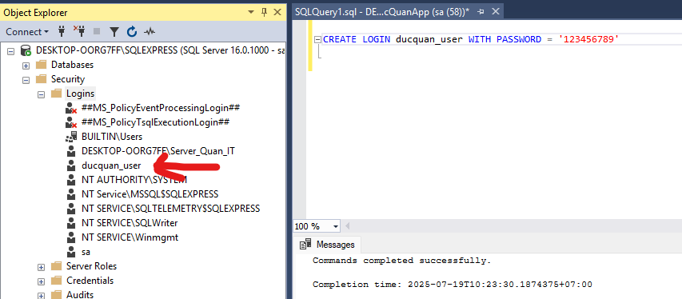

Bước 2: Tạo người dùng trong CSDL `DucQuanApp` để tài khoản vừa tạo có thể truy cập CSDL `DucQuanApp`:  
```SQL
USE DucQuanApp
CREATE USER ducquan_user FOR LOGIN ducquan_user
```

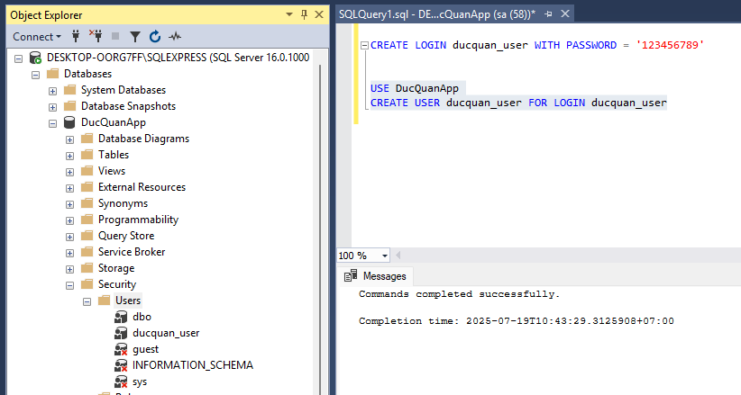

Bước 3: Cấp quyền truy cập cho người dùng để có thể thao tác với dữ liệu:  
```SQL
ALTER ROLE db_datareader ADD MEMBER ducquan_user  -- Cấp quyền đọc dữ liệu  
ALTER ROLE db_datawriter ADD MEMBER ducquan_user -- cấp quyền ghi dữ liệu

-- Cấp quyền quản trị CSDL (Cấp quyền truy cập đầy đủ)
ALTER ROLE db_owner ADD MEMBER ducquan_user
```

Bước 4: Kiểm tra lại quyền truy cập bằng câu lệnh sau:  
```SQL
SELECT 
    dp.name AS UserName, 
    dp.type_desc AS UserType,
    dr.name AS RoleName
FROM 
    sys.database_principals dp
JOIN 
    sys.database_role_members drm ON dp.principal_id = drm.member_principal_id
JOIN 
    sys.database_principals dr ON drm.role_principal_id = dr.principal_id
WHERE 
    dp.name = 'ducquan_user';
```

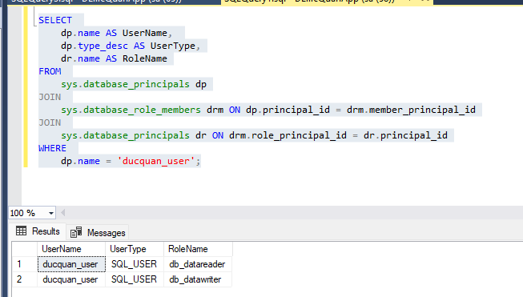

Vậy là đã hoàn thành cấp quyền truy cập CSDL để thao tác với phần mềm.  
Một số lệnh cấp quyền cho người dùng trong SQL Server (Dùng tham khảo cho các trường hợp phân quyền rõ ràng, giới hạn chức năng cho 1 số người):  

Các lệnh `DENY`, `GRANT`, `REVOKE`, và `ALTER ROLE` đều được sử dụng để quản lý quyền truy cập của người dùng trong SQL Server, nhưng chúng có chức năng và cách thức hoạt động khác nhau.  

`DENY`, `GRANT`, `REVOKE` chỉ áp dụng cho người dùng hoặc vai trò (role) trên một đối tượng trong cơ sở dữ liệu (ví dụ: bảng, view, thủ tục, v.v.).   

### 2.7.1 GRANT - Cấp quyền cho người dùng hoặc nhóm người dùng

- Mục đích: Cấp quyền cho người dùng hoặc vai trò (role) trên một đối tượng trong cơ sở dữ liệu (ví dụ: bảng, view, thủ tục, v.v.).  

- Cách thức hoạt động: Khi sử dụng lệnh `GRANT`, bạn cấp quyền cho người dùng hoặc vai trò với khả năng thực hiện một hành động cụ thể (như `SELECT`, `INSERT`, `UPDATE`, `DELETE`) trên các đối tượng của cơ sở dữ liệu.  

> Cú pháp:  
> GRANT <quyền> ON <đối tượng> TO <người dùng> 

```SQL
GRANT SELECT ON dbo.Users TO ducquan_user;  -- Chỉ cấp quyền SELECT cho người dùng đối với bảng Users trong CSDL  
GRANT SELECT, INSERT, UPDATE ON dbo.Users TO ducquan_user;  -- Cấp quyền SELECT, INSERT và UPDATE, không cấp quyền DELETE
```

### 2.7.2 DENY - Từ chối quyền của người dùng cho các thao tác vs DB 

- Mục đích: Từ chối quyền cho người dùng hoặc vai trò đối với một đối tượng trong cơ sở dữ liệu.  

- Cách thức hoạt động: Khi sử dụng lệnh `DENY`, quyền mà bạn đã cấp hoặc chưa cấp sẽ bị từ chối cho người dùng hoặc vai trò đối với một đối tượng. `DENY` có mức độ ưu tiên cao hơn `GRANT`, tức là nếu một người dùng đã có quyền `GRANT` nhưng bạn sử dụng `DENY`, quyền `DENY` sẽ có hiệu lực và người dùng sẽ bị từ chối quyền đó.  

> Cú pháp:  
> DENY <quyền> ON <đối tượng> TO <người dùng> 

```SQL
DENY SELECT ON dbo.Users TO ducquan_user;  -- Từ chối quyền SELECT của người dùng đối với bảng trong DB
```

### 2.7.3 REVOKE - Thu hồi quyền của người dùng

- Mục đích: Thu hồi quyền mà bạn đã cấp trước đó. `REVOKE` sẽ loại bỏ quyền truy cập của người dùng hoặc vai trò đối với một đối tượng mà quyền đó đã được cấp.  

- Cách thức hoạt động: Khi sử dụng lệnh `REVOKE`, quyền truy cập của người dùng hoặc vai trò vào một đối tượng bị thu hồi. Tuy nhiên, lệnh này sẽ không thay đổi quyền nếu người dùng có quyền đó thông qua các vai trò khác.  

> Cú pháp:  
> REVOKE <quyền> ON <đối tượng> TO <người dùng> 

```SQL
REVOKE SELECT ON dbo.Users TO ducquan_user; -- Thu hồi quyền SELECT đổi với người dùng
```

### 2.7.4 ALTER ROLE

- Mục đích: Thay đổi vai trò của người dùng `trong cơ sở dữ liệu`. Lệnh này cho phép bạn thêm hoặc xóa người dùng từ một vai trò cụ thể `trong cơ sở dữ liệu`.  

- Cách thức hoạt động: Khi sử dụng `ALTER ROLE`, bạn có thể thay đổi các vai trò của người dùng trong cơ sở dữ liệu. Vai trò là một nhóm quyền mà bạn có thể cấp cho người dùng. Bạn có thể thêm người dùng vào các vai trò như `db_datareader`, `db_datawriter`, `db_owner`, v.v.  

> Cú pháp:  
> ALTER ROLE <vai trò> ADD MEMBER <người dùng>;  
> ALTER ROLE <vai trò> DROP MEMBER <người dùng>;  

```SQL
ALTER ROLE db_datareader ADD MEMBER ducquan_user;
```

### 2.7.5 Cách truy vấn các quyền đã cấp cho tài khoản người dùng

Kiểm tra các `vai trò` (vai trò được thêm bởi lệnh `ALTER ROLE`) mà người dùng đã tham gia, ví dụ đối với người dùng `ducquan_user`:  
```SQL
SELECT 
    dp.name AS UserName, 
    dp.type_desc AS UserType,
    dr.name AS RoleName
FROM 
    sys.database_principals dp
JOIN 
    sys.database_role_members drm ON dp.principal_id = drm.member_principal_id
JOIN 
    sys.database_principals dr ON drm.role_principal_id = dr.principal_id
WHERE 
    dp.name = 'ducquan_user';

```

Hoặc có thể kiểm tra tất cả `vai trò` trong CSDL:  

```SQL
SELECT 
    dp.name AS UserName, 
    dr.name AS RoleName
FROM 
    sys.database_principals dp
LEFT JOIN 
    sys.database_role_members drm ON dp.principal_id = drm.member_principal_id
LEFT JOIN 
    sys.database_principals dr ON drm.role_principal_id = dr.principal_id
WHERE 
    dp.type IN ('S', 'U')  -- 'S' cho SQL_USER và 'U' cho Windows User
ORDER BY 
    dp.name, dr.name;
```

Kiểm tra `quyền` (quyền được thêm bởi các lệnh `GRANT`, `DENY`, `REVOKE`) mà người dùng đã được cấp đối với các đối tượng cụ thể (ví dụ: bảng, view):  

```SQL
SELECT 
    dp.name AS UserName,
    ob.name AS ObjectName,
    perm.permission_name,
    perm.state_desc AS PermissionState
FROM 
    sys.database_permissions perm
JOIN 
    sys.objects ob ON perm.major_id = ob.object_id
JOIN 
    sys.database_principals dp ON perm.grantee_principal_id = dp.principal_id
WHERE 
    dp.name = 'ducquan_user';
```

Hoặc kiểm tra tất cả các quyền trong 1 dối tượng như bảng `Users`:  
```SQL
SELECT 
    dp.name AS UserName,
    ob.name AS ObjectName,
    perm.permission_name,
    perm.state_desc AS PermissionState
FROM 
    sys.database_permissions perm
JOIN 
    sys.objects ob ON perm.major_id = ob.object_id
JOIN 
    sys.database_principals dp ON perm.grantee_principal_id = dp.principal_id
WHERE 
    ob.name = 'Users';  -- Tên bảng hoặc đối tượng bạn muốn kiểm tra
```

# 3. Tạo 1 navigation mới

Ví dụ thêm 1 navigation có tên là `Cơ sở dữ liệu`, ta sẽ chỉnh sửa như sau.  

## 3.1 Đặt tên và hình ảnh icon của navigation mới

Ta tạo 1 tên mới cho navigation và các icon tương ứng với nó trong tệp [constants](src/utils/constants.py). Tương ứng ở vị trí tên và image như hình ảnh dưới.  

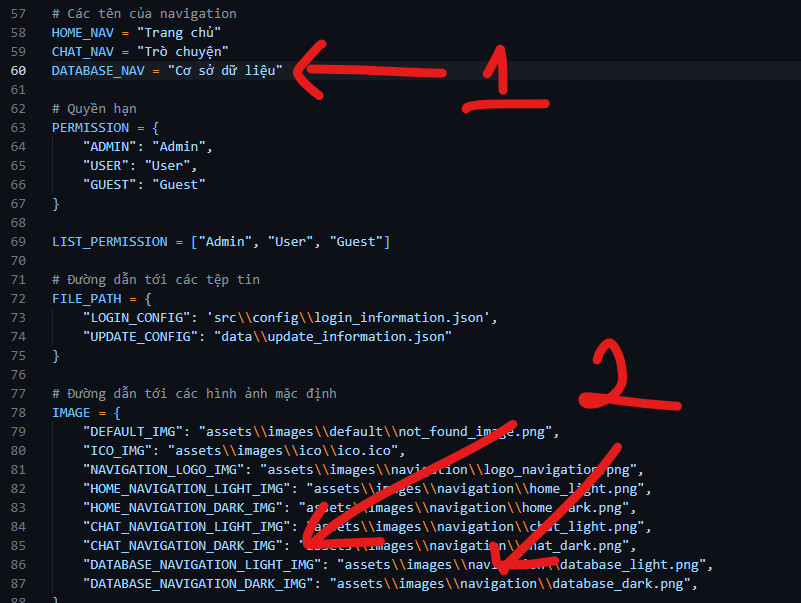

## 3.2 Thêm nút bấm vào navigation

Sau khi đặt tên và có hình ảnh tương ứng, ta thêm dữ liệu vào biến `self.nav_items` trong hàm `__init__` của `App` [tại đây](src/main.py).  

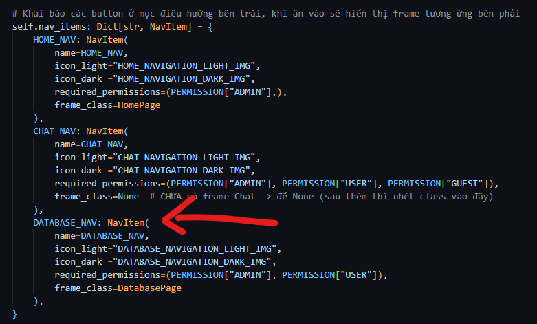  

Với cấu trúc cho mỗi navigation như sau:  
```python
DATABASE_NAV: NavItem(
    name=DATABASE_NAV,
    icon_light="DATABASE_NAVIGATION_LIGHT_IMG",
    icon_dark ="DATABASE_NAVIGATION_DARK_IMG",
    required_permissions=(PERMISSION["ADMIN"], PERMISSION["USER"]),
    frame_class=DatabasePage
)
```

Trong đó:  

- `DATABASE_NAV`: Là tên mà ta đã khai báo trong tệp `contanst.py`  
- `icon_light - icon_dark`: Là 2 hình ảnh nút bấm cho navigation này tương ứng với chế độ sáng và tối  
- `required_permissions`: Là 1 danh sách các quyền hạn có thể được truy cập vào navigation này, những người có quyền hạn ko nằm ở đây sẽ ko thể truy cập  
- `frame_class`: Là 1 class chứa toàn bộ nội dung của navigation này, khi người dùng click vào thì nó sẽ hiển thị  

## 3.3 Tạo class hiển thị giao diện  

Để tạo giao diện cho navigation, khi người dùng nhấn vào nút thì ta sẽ tạo tệp tương ứng ở thư mục [gui](src/gui/).  
Mỗi một class giao diện thì yêu cầu sử dụng cấu trúc như sau:  
```python
from services.database_service import MyDatabase

# Tên class Page hiển thị lên giao diện chương trình bắt buộc phải kế thừa class customtkinter.CTkFrame
class HomePage(customtkinter.CTkFrame):
    """
    Tạo giao diện cho trang chủ của phần mềm
    """
    def __init__(self, parent, database_service: MyDatabase):
        """
        parent là frame cha
        database_service là kết nối chung 
        """
        # Khởi tạo DB chung
        self.db = database_service
```
Vì ta sử dụng `semaphore` để giới hạn số connection, nên chỉ cần `một instance MyDatabase duy nhất` cho toàn bộ app.  
Nếu tạo nhiều instance MyDatabase thì sẽ tạo nhiều semaphore độc lập và tổng giới hạn sẽ tăng theo, dẫn đến việc vượt quá số connection tối đa của SQL Server.  
Ví dụ: nếu `MyDatabase` có giới hạn `4 connection`, thì tạo 3 instance MyDatabase sẽ cho phép tối đa `12 connection` cùng lúc, vượt quá giới hạn của SQL Server.  

> Vì vậy chỉ khởi tạo 1 instance MyDatabase tại tệp main.py và truyền nó vào các giao diện khác  

Tại đây ta tạo tệp tương ứng với `database navigation` sẽ có tên là [database_window](src/gui/database_window.py). Class trong tệp này kế thừa thuộc tính là `CtkFrame` từ `Customtkinter`.  

Tùy theo giao diện mà ta sẽ tạo nó tương ứng với nhu cầu, tuy nhiên cần đúng định dạng là 1 Frame. Có thể tham khảo tại thư mục `gui` các giao diện trước đó.  

> [!QUESTION]  
> ❓ Các câu hỏi thường gặp  